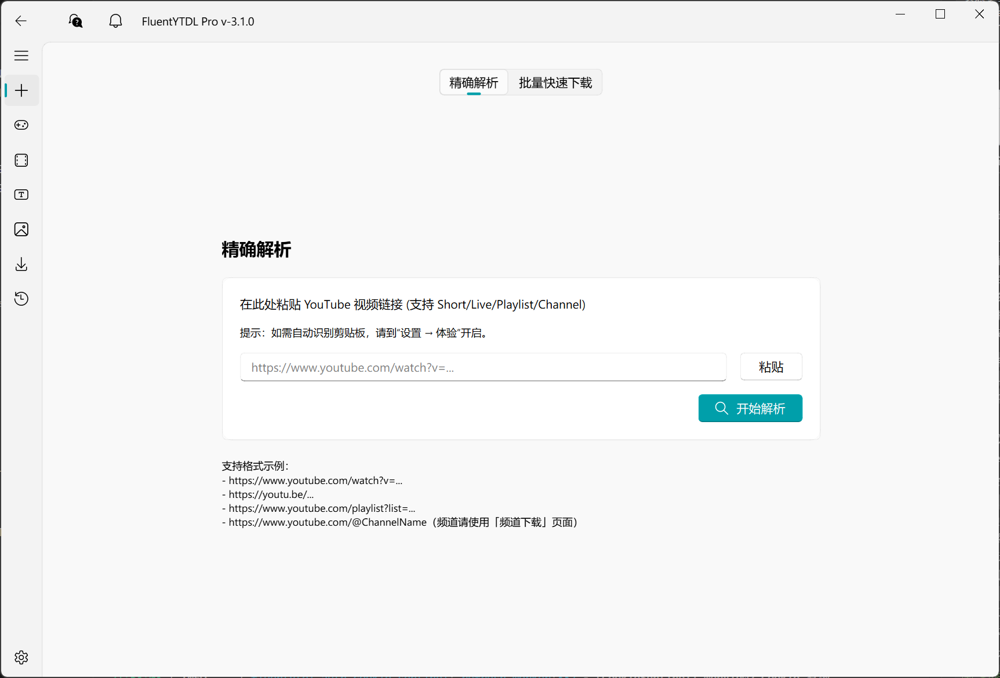
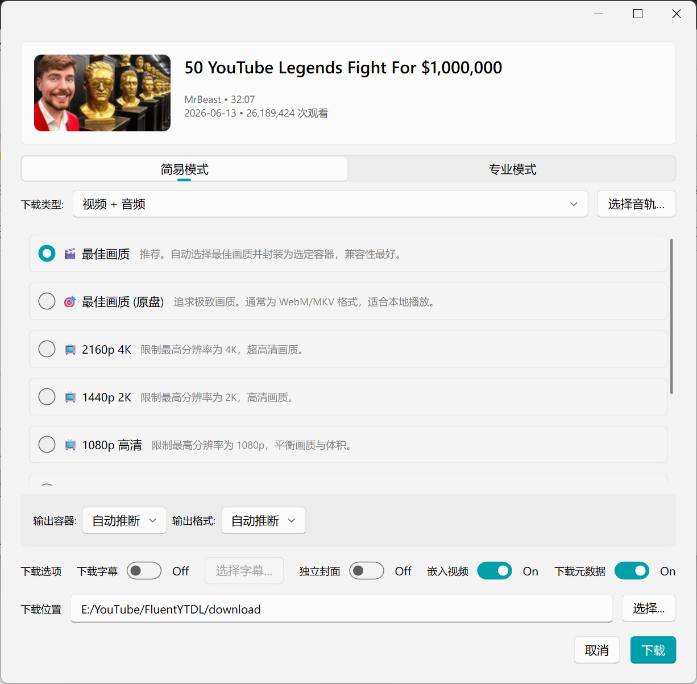
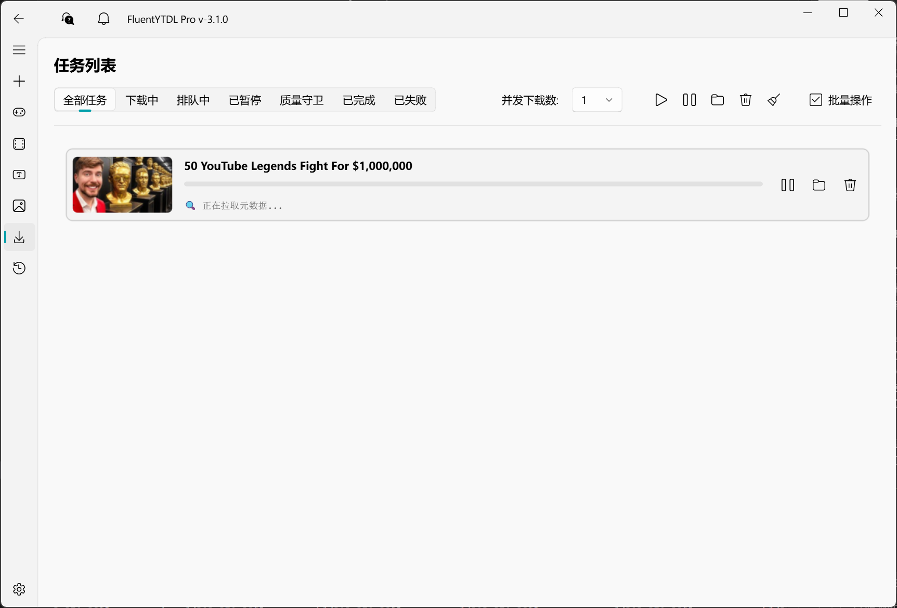

<p align="center">
  
</p>

<h1 align="center">FluentYTDL</h1>

<p align="center">
  基于 PySide6、yt-dlp 与 FFmpeg 的 Windows 桌面端 YouTube / X 媒体下载工具。
</p>

<p align="center">
  <a href="README.md">English</a> ·
  <a href="#功能">功能</a> ·
  <a href="#安装">安装</a> ·
  <a href="#开发">开发</a> ·
  <a href="docs/ARCHITECTURE_CN.md">架构</a>
</p>

<p align="center">
  <a href="https://github.com/SakuraForgot/FluentYTDL/releases/latest"></a>
  <a href="LICENSE"></a>
  
  
  <a href="https://github.com/SakuraForgot/FluentYTDL/actions/workflows/ci.yml"></a>
</p>

FluentYTDL 通过原生 Fluent Design 界面提供稳定、可观察的媒体下载流程。程序将 yt-dlp 保持在 CLI 子进程边界中，协调 FFmpeg 后处理、任务持久化，并提供格式、音轨、字幕、封面、视频裁切、播放列表和 VR 等工作流，用户无需自行拼接命令行参数。

本项目主要面向 64 位 Windows 10 和 Windows 11。YouTube 拥有最完整的功能覆盖；X 目前只正式支持包含可下载媒体的单条帖子链接，不宣称支持个人主页或时间线批量下载。

## 界面预览

| 解析 | 格式选择 | 任务队列 |
|:--:|:--:|:--:|
|  |  |  |

## 功能

- **视频与音频选择**：选择分辨率、容器、编码和首选音轨语言，或直接使用简易画质预设。
- **批量工作流**：解析 YouTube 播放列表和频道，按需加载条目详情，并将选中内容加入队列。
- **稳定的任务管理**：可配置并发、任务状态持久化、独立临时目录、取消清理和重启恢复。
- **质量检查**：比较目标与可用格式，显示画质降级提示，并可通过 FFprobe 验证输出媒体信息。
- **字幕与封面**：独立下载字幕或封面，合并双语字幕，并嵌入支持的元数据与图片。
- **视频裁切**：为普通 YouTube 单视频选择时间范围，支持快速裁切和精确裁切模式。
- **后处理**：通过 FFmpeg 合并与转换媒体，集成 SponsorBlock、封面嵌入和可选 VR 投影转换。
- **账号验证**：在本地管理 Cookie 生命周期，并通过隔离的 WebView2 登录流程处理需要会话的网站。
- **组件管理**：使用校验和验证应用及外部媒体工具更新。

## 支持范围

| 范围 | 当前支持情况 |
|---|---|
| 操作系统 | Windows 10/11，64 位 |
| YouTube | 视频、Shorts、直播/视频链接、播放列表、频道、字幕、封面和 VR 工作流 |
| X（Twitter） | 含可下载媒体的单条帖子链接 |
| 其他 yt-dlp 网站 | 不属于当前正式支持范围 |
| 源码运行 | Python 3.10 或更高版本 |

FluentYTDL 依赖上游网站与工具。网站改动、媒体 URL 过期、账号或地区限制以及 yt-dlp 回归，都可能暂时影响解析或下载。

## 安装

### Windows 构建包

从 [GitHub Releases](https://github.com/SakuraForgot/FluentYTDL/releases/latest) 下载最新安装包或便携包：

- `*-setup.exe`：Windows 安装程序
- `*-full.7z`：包含完整运行环境的便携包
- `*-app-core.7z`：仅应用核心的更新包

发布资产同时提供 `SHA256SUMS.txt`。重新分发或长期归档时建议验证校验和。FluentYTDL 官方构建仅通过本仓库发布；第三方构建不由本项目维护或背书。

### 从源码运行

```powershell
git clone https://github.com/SakuraForgot/FluentYTDL.git
cd FluentYTDL

# 推荐使用 uv
uv sync --extra dev
uv run python main.py
```

也可以创建 Python 虚拟环境，运行 `pip install -e ".[dev]"`，然后使用 `python main.py` 启动。

程序会管理 yt-dlp、FFmpeg、Deno 和 AtomicParsley 等外部组件。源码工作区首次使用相关功能时，可能会下载缺失组件。

## 开发

仓库采用 `src/` 包布局。界面基于 PySide6 和 PySide6-Fluent-Widgets；后端按账号验证、下载、处理、存储与 YouTube 服务分层。yt-dlp 通过 CLI 子进程运行，而不是作为下载引擎直接导入。

```powershell
uv sync --extra dev
uv run ruff check src tests

$env:QT_QPA_PLATFORM = "offscreen"
uv run pytest tests -q

uv run python scripts/version_manager.py check
```

进行较大修改前，请先阅读：

- [贡献指南](CONTRIBUTING.md)
- [架构说明](docs/ARCHITECTURE_CN.md)
- [开发规则](docs/RULES.md)
- [yt-dlp 集成知识](docs/YTDLP_KNOWLEDGE.md)
- [安全政策](SECURITY.md)

## 安全与合理使用

Cookie、日志、下载内容和本地配置可能包含敏感信息。请勿在 Issue 中附加未脱敏的 Cookie、凭据、Token 或私人链接。安全漏洞请通过 [SECURITY.md](SECURITY.md) 中的私密流程报告。

请仅下载你有权访问和保存的内容。用户有责任遵守适用法律、著作权规则和平台条款。本项目不会为用户提供访问私人或受限内容的权限。

## 贡献与治理

欢迎可复现的错误报告、范围明确的 Pull Request、文档改进和平台反馈。请阅读 [CONTRIBUTING.md](CONTRIBUTING.md)、[行为准则](CODE_OF_CONDUCT.md) 与 [维护者说明](MAINTAINERS.md)。

源代码使用 [GNU General Public License v3.0](LICENSE)。单独的[商标政策](TRADEMARK.md)管理 FluentYTDL 名称和品牌的使用，但不会减少 GPL-3.0 授予的代码权利。[学术诚信说明](ACADEMIC_HONESTY.md)解释署名与诚信要求，不附加许可证限制。

## 致谢

FluentYTDL 建立在 [yt-dlp](https://github.com/yt-dlp/yt-dlp)、[FFmpeg](https://ffmpeg.org/)、[PySide6](https://doc.qt.io/qtforpython-6/)、[PySide6-Fluent-Widgets](https://github.com/zhiyiYo/PyQt-Fluent-Widgets)、[SponsorBlock](https://sponsor.ajay.app/) 和 [bgutil-ytdlp-pot-provider](https://github.com/Brainicism/bgutil-ytdlp-pot-provider) 等开源项目之上。第三方声明收录于 [`licenses/`](licenses/)。
