# FluentYTDL 官方参考指南 (Reference / Wiki)

欢迎查阅 FluentYTDL 官方参考指南。本文档将带您从零开始快速上手，深入了解核心功能，排查疑难杂症，并为高级用户提供架构参考。

---

## 1. 快速开始 (Quick Start)

### 1.1 环境依赖

无论您是普通用户还是开发者，在运行或使用 FluentYTDL 之前，请确保您的环境满足以下核心要求：

#### 🖥️ 操作系统要求
- **Windows 10 / Windows 11 (64-bit)**：目前软件深度集成了 Windows 底层特性（如任务栏进度条、深色模式适配、进程强杀树等），暂未官方支持 macOS 与 Linux。
- **WebView2 运行时**：Windows 11 通常已自带。如果您使用较旧的 Windows 10，当软件需要提取浏览器 Cookie 时，可能需要确保系统中已安装 [Microsoft Edge WebView2 运行时](https://developer.microsoft.com/en-us/microsoft-edge/webview2/)。

#### 📦 核心外部依赖 (普通用户组件清单)
为了让 FluentYTDL 实现所有高级功能，除了主程序外，还需要以下外部二进制组件的支持。便携版/全量包通常已内置这些文件，但如果您使用精简包或自行配置环境，请确保以下组件位于相应的 `_internal/` 目录或系统环境变量 (PATH) 中：

1. **`yt-dlp.exe`** (核心解析与下载引擎)
   - **必需性**：绝对必需。缺失会导致完全无法解析和下载。
   - **推荐存放路径**：`_internal/yt-dlp/yt-dlp.exe`
2. **`ffmpeg.exe` & `ffprobe.exe`** (音视频混流与后处理管线)
   - **必需性**：绝对必需。YouTube 的高画质视频和音频是分离的，必须依赖 FFmpeg 混流。此外，VR180 视频的投影转换、封面的嵌入也强依赖于此。
   - **推荐存放路径**：`_internal/ffmpeg/`
3. **POT Manager 提供者插件 (`bgutil-ytdlp-pot-provider`)**
   - **必需性**：用于过掉 YouTube 的 `Sign in to confirm you're not a bot` 机器人检测。
   - **说明**：软件已内置该 Python 插件的源码，在运行时会自动将其同步注入到 `yt-dlp.exe` 同级目录下的插件文件夹中，请勿手动干预删除。
4. **`AtomicParsley.exe`** (封面/元数据注入工具)
   - **必需性**：可选（推荐）。
   - **说明**：部分纯音频格式（如 m4a）通过 FFmpeg 嵌入封面时会破坏文件结构，yt-dlp 底层默认优先调用 AtomicParsley 来完美嵌入封面。
   - **推荐存放路径**：`_internal/bin/` 或加入系统 PATH。

#### 🐍 开发者与源码运行环境
如果您打算通过源码运行或参与二次开发，请确保您的 Python 环境满足以下要求：
- **Python 版本**：`>= 3.10`
- **核心包依赖**：
  - `yt-dlp[default] >= 2025.11.12` （提供核心解析与下载能力）
  - `PySide6 >= 6.10.0, < 6.11.0` （UI 框架底层）
  - `PySide6-Fluent-Widgets >= 1.10.0, < 1.11.0` （微软 Fluent Design 风格组件库）
  - `rookiepy >= 0.5.6` （用于跨浏览器 Cookie 本地提取）
  - `pywebview >= 5.0.0` （用于弹窗提供 WebView2 登录环境）
  - 其他辅助库如 `requests`、`loguru`、`Pillow`、`markdown` 等。

*(详见项目根目录下的 `pyproject.toml` 文件)*

### 1.2 安装步骤与版本选择

当您前往 GitHub Release 页面下载时，通常会看到三种不同的文件格式。对于绝大多数用户，**我们强烈推荐下载并使用「Full 完整便携版 (Full Package)」**，请不要下载错文件：

#### 🚀 推荐下载：`FluentYTDL-vX.X.X-win64-full.7z` (完整便携版)
- **获取方式**：这是体积较大的 `.7z` 压缩包（约 190MB）。
- **包含内容**：包含了主程序以及所有必需的核心外部依赖（`yt-dlp.exe`、`ffmpeg.exe` 等）。
- **安装步骤**：**解压即用**。请将压缩包解压到一个您具有完整读写权限的英文路径下（避免解压到 C 盘的 `Program Files` 目录下以防权限阻拦），双击解压文件夹内的 `FluentYTDL.exe` 即可启动。

#### ❌ 不推荐：`FluentYTDL-vX.X.X-win64-setup.exe` (传统安装包)
虽然我们提供了安装程序，但**不推荐**使用它。写入注册表和 C 盘权限问题不仅可能在运行时产生莫名其妙的读写阻拦，还会增加后期转移软件的成本。为了最纯净、最稳定的体验，请坚持使用“解压即用”的 Full 便携包。

> ⚠️ **防坑警告：千万不要只下载 `app-core.7z`！**
>
> 很多小白用户为了省流量或下载快，会去下载体积最小的 `FluentYTDL-vX.X.X-win64-app-core.7z`（约 60MB）。
> 请注意，**这不是一个可以直接使用的新手版本！** 它是软件的**主程序增量更新包**（不含任何如 FFmpeg 等重量级底层 `bin/` 组件）。这是提供给软件内部自动更新机制拉取使用的，如果您直接下载它并作为全新安装运行，软件将因为完全丧失解析和下载能力而彻底罢工。

### 1.3 快速下载

解压并双击 `FluentYTDL.exe` 启动主程序后，让我们通过一次完整的“闭环”操作，下载您的第一个 YouTube 视频。

#### 第一步：登录并提取账号凭证 (防风控必备)
为了避免遭到 YouTube 机器人的验证拦截（以及解锁年龄限制和会员视频），**强烈建议**在首次使用时进行账号登录：
1. 点击左侧边栏底部的齿轮图标进入 **设置页**。
2. 找到 Cookie 与身份验证区域，点击按钮触发本地浏览器提取或登录。

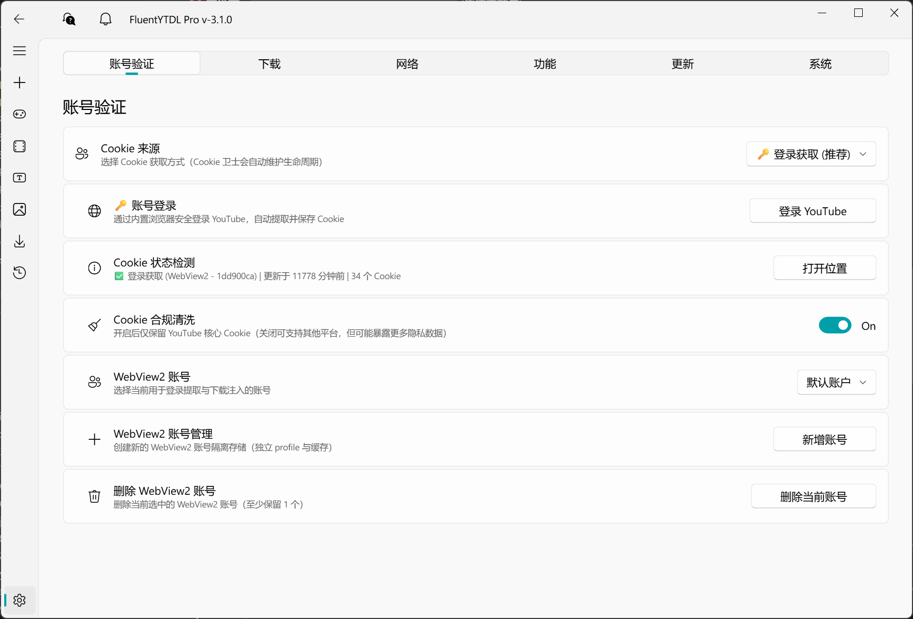

通过内嵌的 Webview2 浏览器环境，您可以安全地完成 Google 账号的登录。完成后，底层的 `CookieSentinel` 守护进程会自动接管凭证的刷新工作。

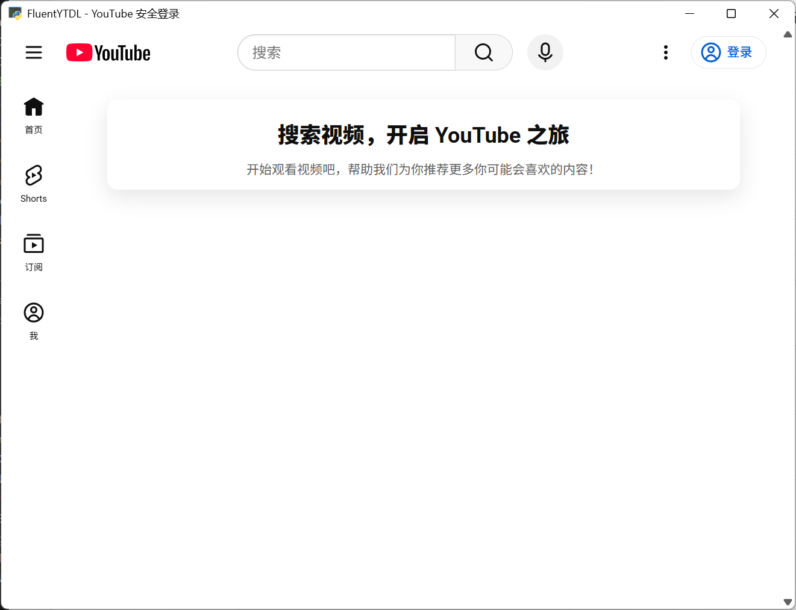

#### 第二步：粘贴链接与精确解析
完成账号授权后，回到软件 **主界面**。
1. 将你在 YouTube 复制的视频链接粘贴到顶部的地址栏中。
2. 点击右侧的 **“解析 (Parse)”** 按钮。

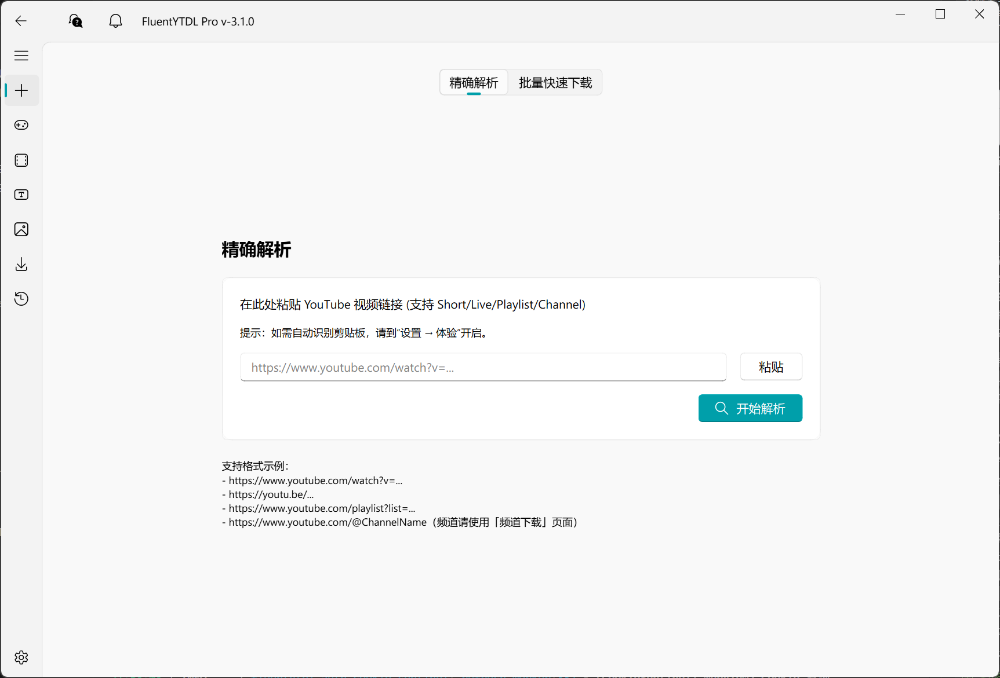

#### 第三步：选择心仪的画质与音轨
解析成功后，软件会弹出一个高度定制的解析卡片页。在这里，FluentYTDL 底层的多通道管线已经帮您把所有混杂的流媒体格式梳理得井井有条。
1. 在**上侧**挑选您想要的最高视频画质（如 4K/8K），同时可以在**右上角**指定您需要的配音音轨（支持中文等外语自动识别）。
2. 在**下侧**自由搭配您需要的其他参数选项（如提取字幕等）。
3. 确认无误后，点击右下角的 **“下载”**。

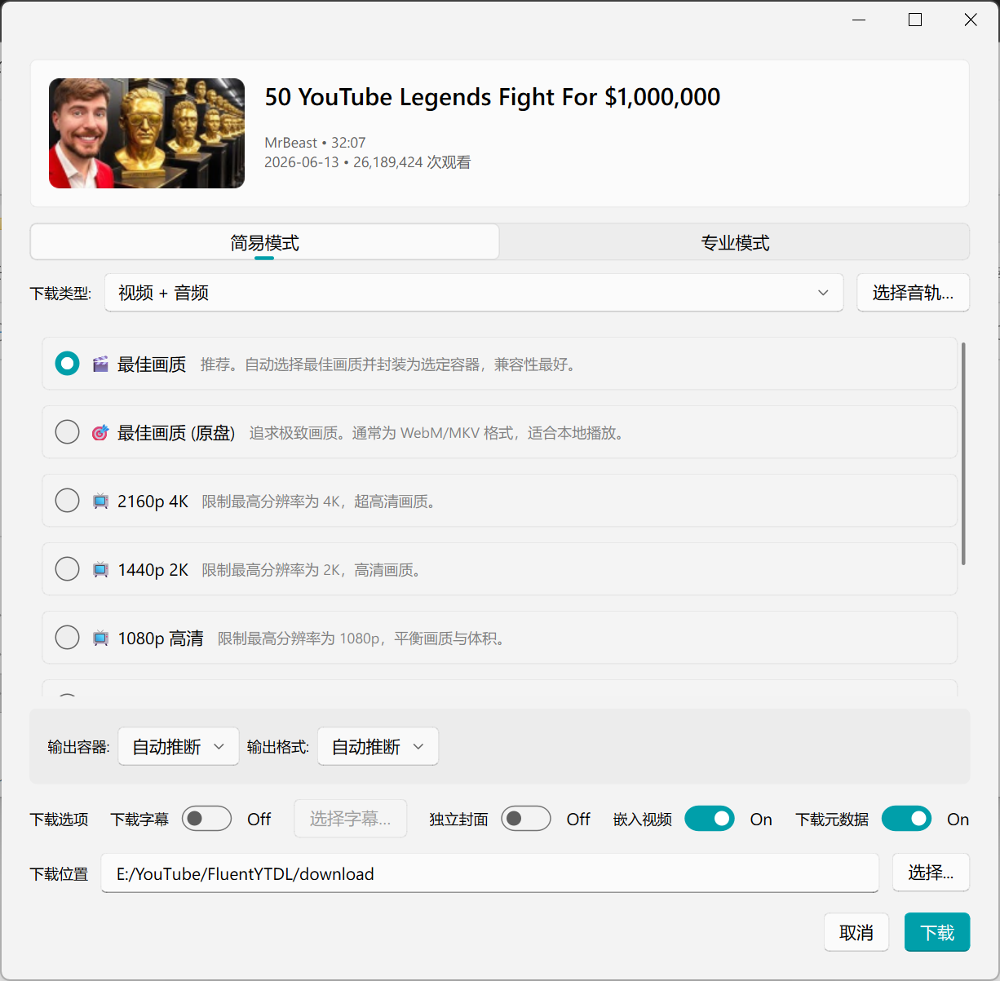

#### 第四步：任务列表与沙箱下载闭环
点击下载后，任务会被送往底层的多线程队列。
1. 点击左侧边栏进入 **“任务列表”**，您可以实时查看当前的下载网速与进度。
2. 进度条跑满 100% 后，底层 FFmpeg 会自动合并音视频。合并成功后，文件会从临时沙箱安全转移到您的最终下载目录中。

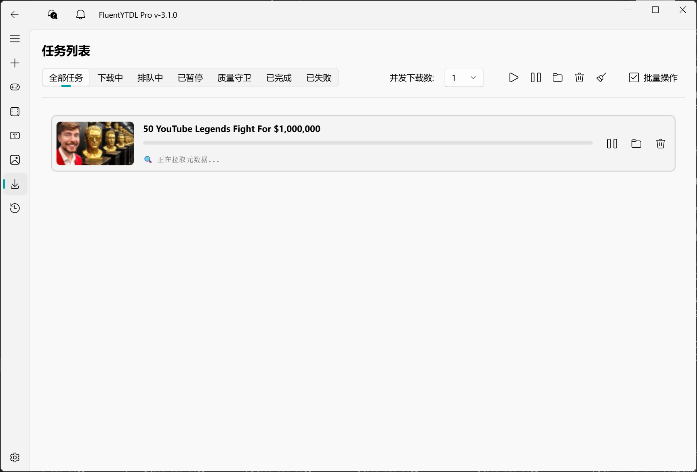

🎉 **恭喜您！您的第一个最高画质、原生匹配音轨的视频已经成功下载完毕。**

---

## 2. 核心功能与使用指南 (Usage Guide)

### 2.1 精确解析功能介绍

精确解析是 FluentYTDL 最核心的单视频解析引擎，它能够穿透极其复杂的底层流媒体格式，为您提供直观的下载选项。
当您点击“解析”按钮后，默认会进入**简易模式 (Simple Mode)**。该模式专为绝大多数用户的日常需求设计，隐藏了繁琐的 DASH 流分离细节。

#### 📌 简易模式核心功能拆解

##### 1. 下载类型与画质选择
在顶部的“下载类型”选项卡中，您可以自由切换为 **“视频+音频”**、**“仅视频”** 或 **“仅音频”**。
选定类型后，在主要列表区域，软件底层的多通道管线已经自动为您最佳匹配了相应的流数据组合。您只需像在 YouTube 网页播放器中一样，直观地选择最终所需的封装画质（例如 4K 2160p、1080p）或音频质量。

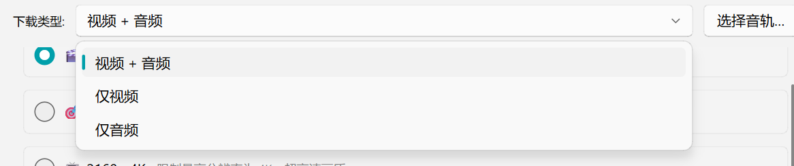

##### 2. 智能多语言配音 (Dubbed Audio) 选择(简易模式界面)
许多顶级 YouTube 频道的视频如今都内嵌了多国语言配音（例如原音是英语，但自带官方中文配音）。
在界面右上角的 **音轨 (Audio Track)** 区域，FluentYTDL 底层的 BCP-47 扩展库会自动嗅探并翻译所有隐藏的配音流。
如果您需要中文配音，只需在此下拉菜单中选中 `中文`。底层 FFmpeg 引擎在合并时会自动剔除原音，将您指定的配音完美封装进去。

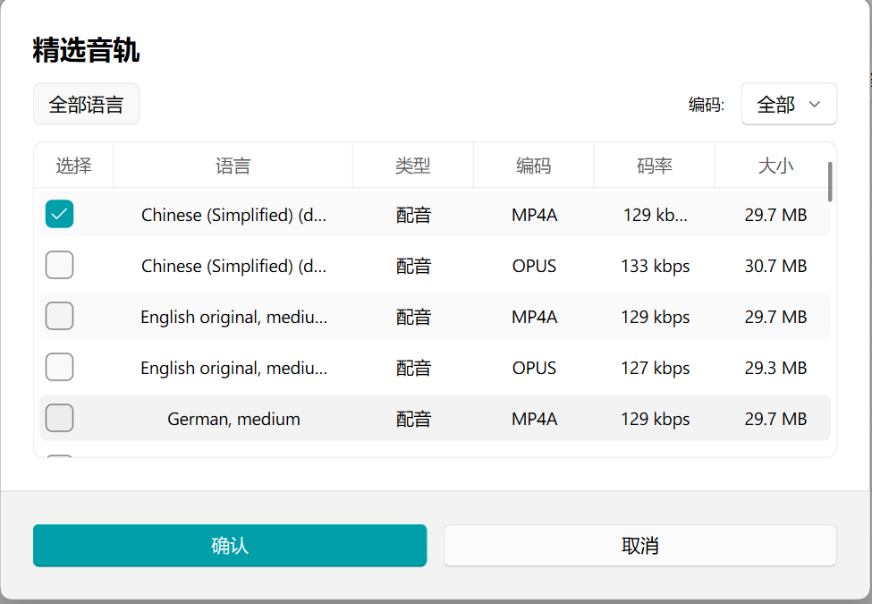

##### 3. 多国字幕提取与封装
在界面下方的 **字幕 (Subtitles)** 区域，软件会列出视频携带的所有可用字幕轨道。
这不仅包含了创作者手动上传的官方字幕，还囊括了 YouTube 的机器自动翻译字幕 (Auto-translated)。勾选所需语言后，引擎会自动下载它们，并根据格式选择将其软封装入最终的视频文件（如 `.mkv`），或者直接保存为外挂的字幕文件（`.vtt`/`.srt`）。

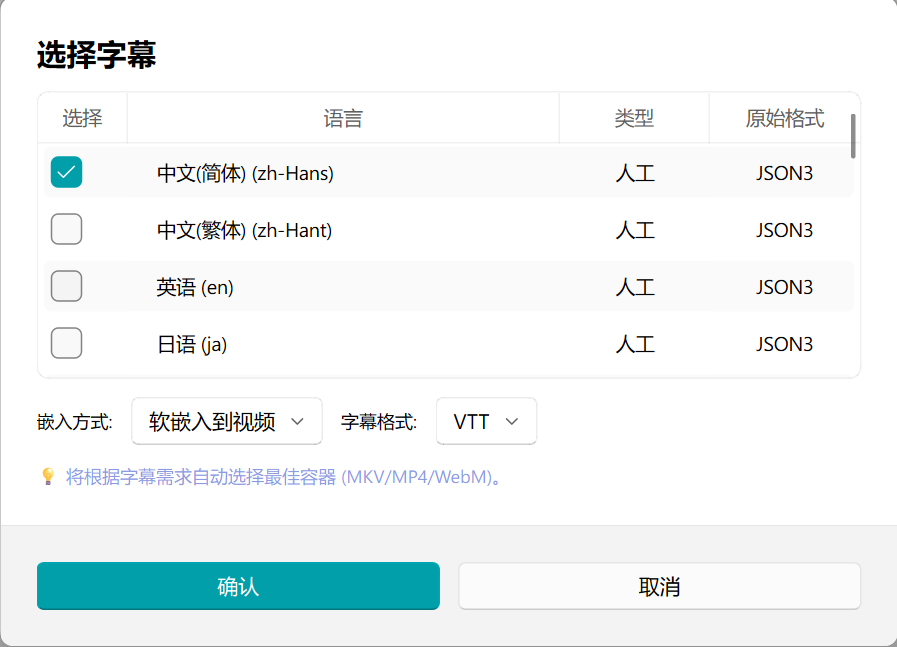

#### 🛠️ 专业模式 (Advanced Mode)

如果您是喜爱折腾的高级玩家，可以通过解析页顶部的标签切换到 **“专业模式”**。在这里，FluentYTDL 将彻底褪去伪装，为您完全展现 YouTube 底层硬核的 DASH 分离流数据，赋予您骨灰级的搭配权限。

##### 1. 硬核流媒体分离选择 (视频流 & 音频流)
与“简易模式”中打包好的“傻瓜式”选项不同，在专业模式下，您需要**分别独立**选择“视频流”和“音频流”。
- **视频流 (Video Stream)**：您可以直白地看到每个分辨率背后真实的视频编码器（如 `avc1`, `vp9`, `av01`）、帧率 (fps)、以及精确到 KB 的文件大小。对于老旧设备用户，您可以借此精准避开无法硬解的 AV1 编码。
- **音频流 (Audio Stream) - 核心区别**：**请注意，这与简易模式中的“音轨”完全不同！** 简易模式的“音轨”是基于语言维度（如选择中文配音）；而这里的“音频流”是**基于物理编码格式的维度**（如 `mp4a`, `opus`，以及不同的音频采样比特率）。如果您不需要多语言配音，只追求极致的声学体验，可以在这里手动挑选 160k 的 Opus 音频，并让底层将其与 4K 视频流进行完美“缝合”。

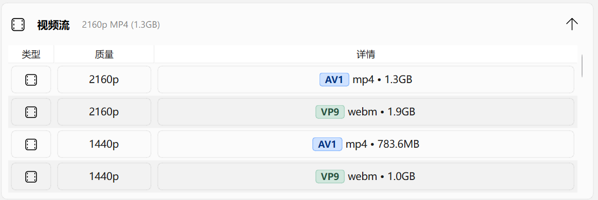
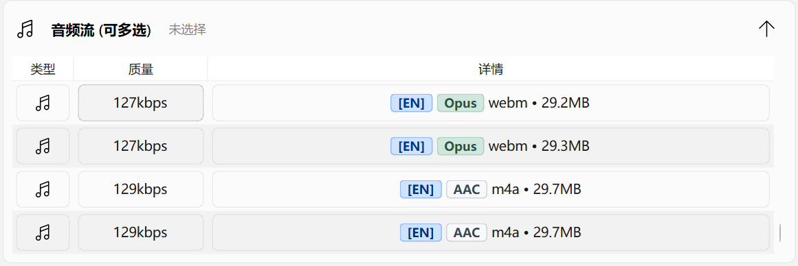

##### 2. 下载类型 (组装流 vs 整合流) 与输出容器
- **下载类型**：这里不仅支持“仅视频”、“仅音频”的逻辑分离，还能让您透视 YouTube 底层的两种视频封装概念：
  - **组装流 (DASH)**：YouTube 为节约带宽，会将高清画质（如 1080p / 4K / 8K）的画面流与高音质音频流**分开存储**。当你下载时，软件会分别拉取这两条流，然后通过本地的 FFmpeg 将其硬核“组装”拼接成一个完整视频。这也是最高画质的必经之路。
  - **整合流 (Pre-merged)**：这是 YouTube 服务器端已经预先封装好的“带声音的视频流”。通常画质较低（最高多为 720p），优点是下载后直接可用，无需 FFmpeg 参与二次混流。
- **视频输出容器 & 音频输出格式**：YouTube 官方原生的流媒体格式经常是 `webm`，在某些播放器上可能存在兼容性问题。您可以在这里强制要求 FFmpeg 在无损组装/合并完原始流后，将其重新封装为更通用的 `mp4` 或 `mkv`；甚至对于纯音频任务，您可以要求将其强行转码重混为 `mp3` 或 `flac`。

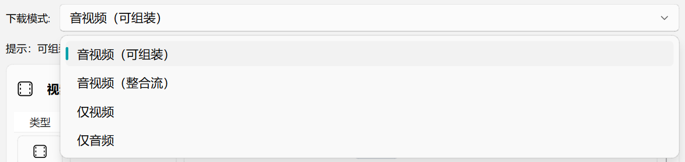

##### 3. 终极刮削器：元数据与封面嵌入
专业模式下开放了极具吸引力的媒体元数据掌控权。只需在底部勾选**“写入元数据”**和**“嵌入封面”**，底层的 AtomicParsley / FFmpeg 管线就会将该 YouTube 视频的真实标题、频道作者、发布日期等详情，连同超清封面海报一起，直接“硬写入”到文件的 ID3/元数据标签中。这是为 Plex、Emby 等本地媒体库爱好者准备的“神级”特性！

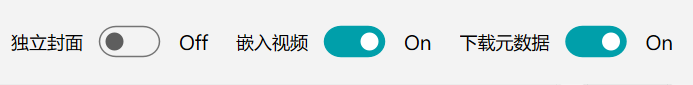

### 2.2 播放列表解析与批量处理

当您向 FluentYTDL 输入一个包含几十上百个视频的播放列表 (Playlist) 或频道 (Channel) 链接时，得益于底层的“视口感知调度器”，软件能够毫秒级响应并光速拉取整个列表的视频信息。

#### 1. 放入播放列表链接
操作与单视频完全一致。在主界面的地址栏粘贴带有 `list=` 参数的播放列表链接或频道链接，然后点击“解析”。

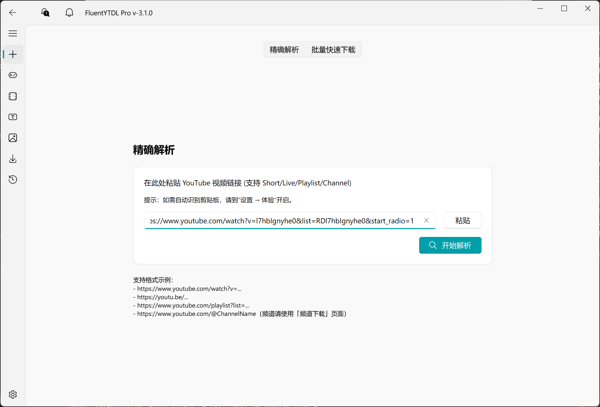

#### 2. 播放列表解析卡片页
解析完成后，软件会弹出一个专为批量下载设计的播放列表解析大盘。这里清晰展示了列表内包含的所有视频，并提供了一键式的全局掌控与精细化的独立控制双重模式。

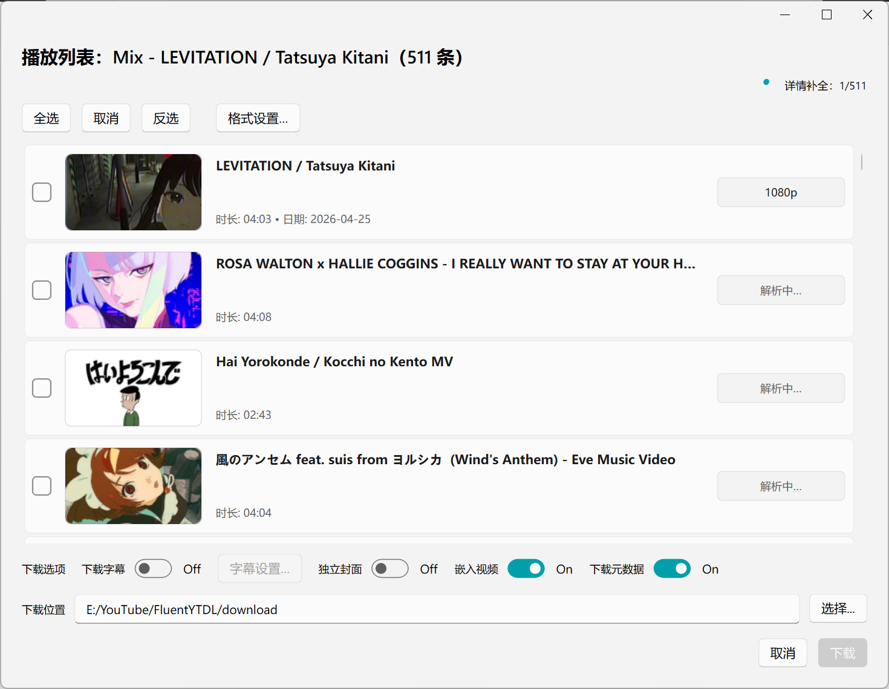

#### 3. 全局格式与字幕的“一键应用”
在列表页的**上侧区域**，您可以统一选定一个目标画质和下载类型（例如统一设定为 1080p 或统一下载为纯音频）。
**这里的杀手锏在于：在这个区域选定的所有参数，会自动且瞬间应用到下方列表中的所有勾选视频上！** 您无需一个一个去修改画质。
同时，您可以在下侧的“字幕语言设置”，为整个播放列表统一指定要提取的多国字幕。

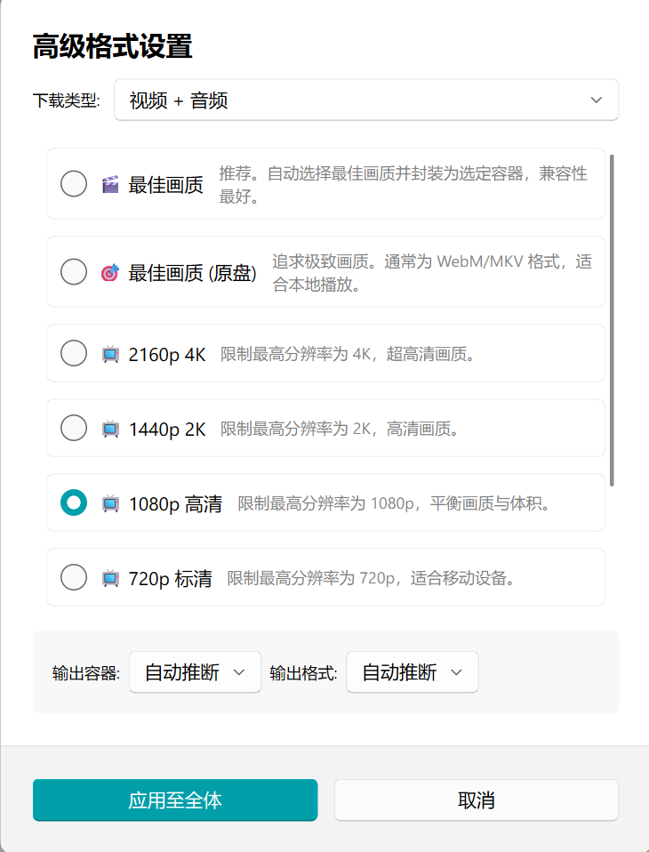
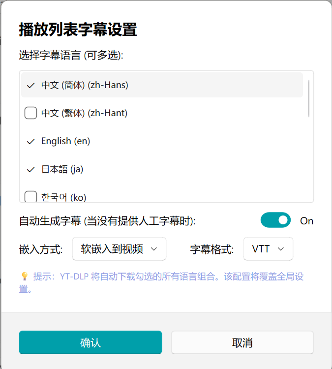

#### 4. 特定视频的独立微调 (特例处理)
如果在这个播放列表中，您希望绝大多数视频保持 1080p，但对其中某几个特殊的视频（如最喜欢的 MV）想要强行拉满到 4K 或是指定其他音轨，该怎么办？
很简单！您只需**点击下方列表中该视频最右侧的画质显示区域**。
点击后，会立即弹出一个悬浮窗口。您会发现这个悬浮窗其实就是我们之前提到的 **“2.1 单视频精确解析”** 界面。在这里，您可以针对这**单一视频**自由调整其专属的参数，甚至切进“专业模式”进行拆解混流。这种微调操作绝对独立，**完全不会影响**列表中其他视频的全局设置。

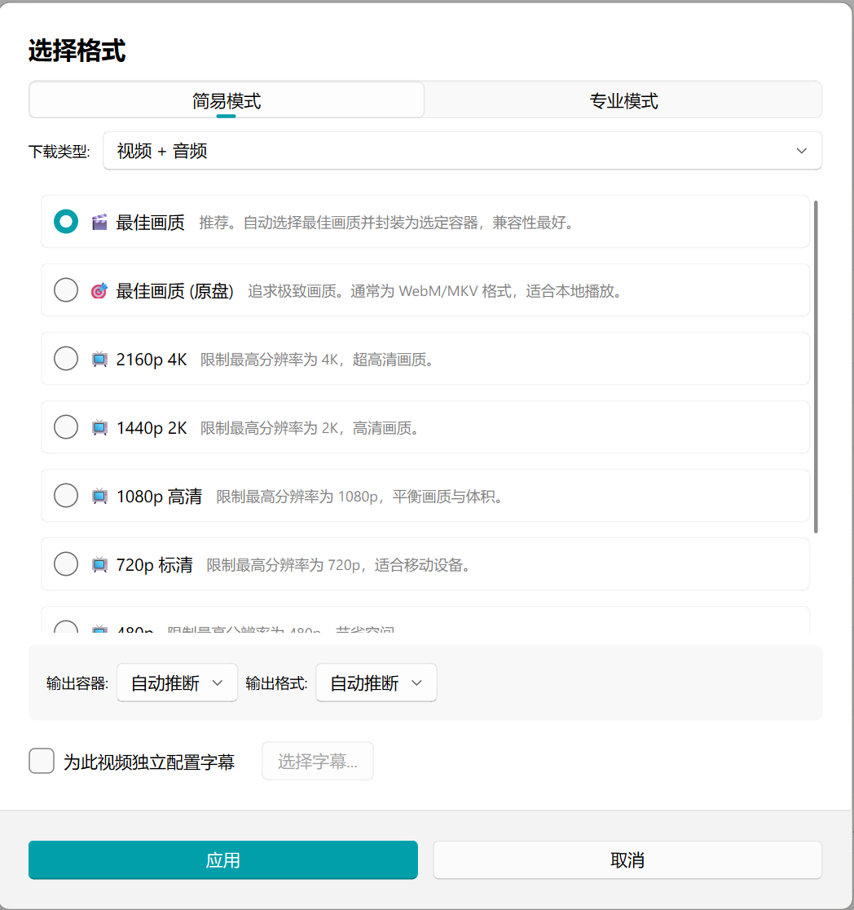

### 2.3 频道解析与批量下载

如果您想要一次性打包下载某个 YouTube 博主的所有公开视频，FluentYTDL 也提供了硬核的“频道解析”功能。

#### 1. 频道链接与智能探测
将 YouTube 频道主页的链接（通常是以 `@` 开头的 handle 链接，或是 `channel/` 链接）直接粘贴到主界面的地址栏中。
**探测功能 (Probe)**：当软件识别到这是一个频道级链接时，在正式解析之前，您可以利用旁边的探测功能，预先扫描并嗅探该频道包含的视频总数等宏观信息，让您在动辄几百上千个视频的批量下载前“心中有数”。确认无误后，点击“解析”即可触发视口感知调度器，开始极速拉取频道的全部视频信息。

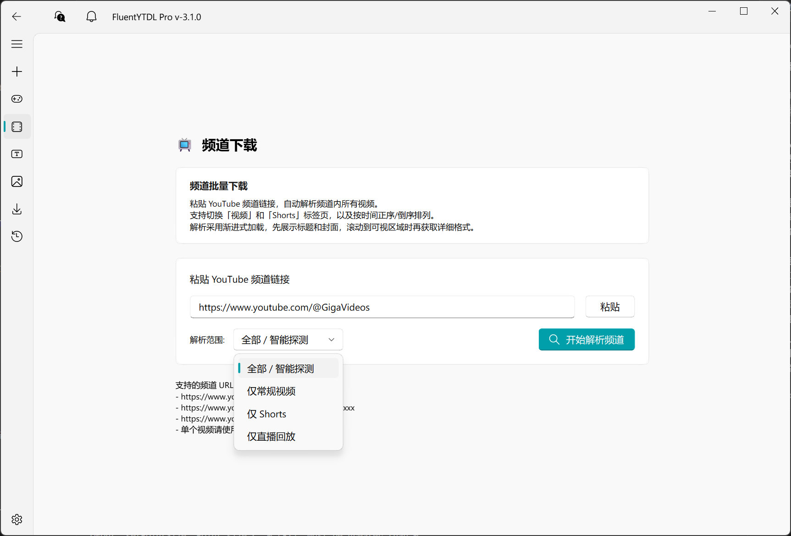

#### 2. 频道解析卡片大盘
解析进度条跑完后，您将进入壮观的“频道解析页”。
**这里的界面结构与操作逻辑，与前面讲过的 “2.2 播放列表解析” 高度重合**：
- **全局一键应用**：您同样可以在顶部统一下达指令（例如全部以 1080p 视频+音频的格式下载），这些指令会瞬间覆盖下方所有打勾的视频。也可以在下侧统一配置全局字幕。
- **特定微调**：如果这个博主早年的视频您想下 720p 节约空间，最新的视频想拉满 4K，依然可以点击对应视频最右侧的画质区域，呼出独立控制台进行特例处理。

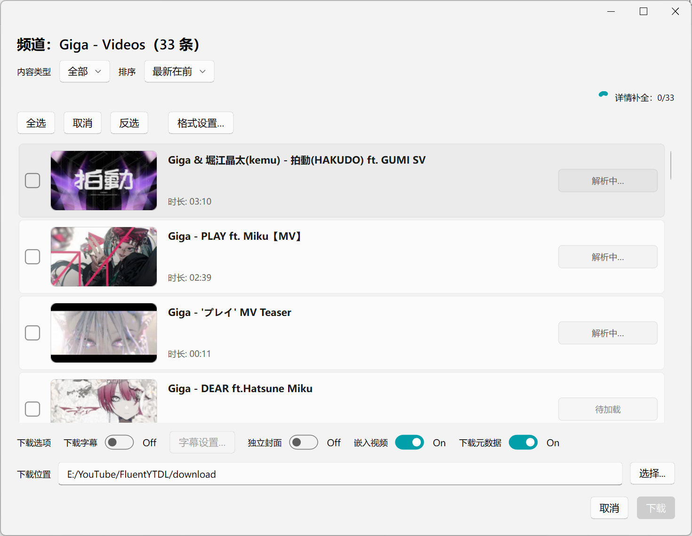

### 2.4 VR 视频专区 (VR180 / VR360)

随着 YouTube 上 VR 内容的迅速爆发，FluentYTDL 在底层专门打造了强悍的 VR 视频特化解析引擎。普通下载器在处理 VR 视频时往往会下载到畸变的 EAC 格式，而我们提供了终极的解决途径。

#### 1. VR 属性智能识别
将 VR 视频（通常为 VR180 或 VR360 格式）的链接输入主界面并点击解析后，FluentYTDL 会从深层元数据中精准提取其 3D 属性，并打上 `[VR]` 标签。

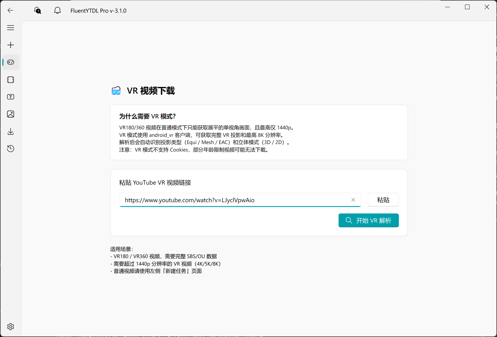

#### 2. VR 解析页 - 简易模式
进入简易模式的解析卡片，界面会特别提醒您“当前正在处理 VR 视频”。
这里的“画质选择”与普通视频表面上一致，但实际上拉取的是携带全景视场角 (FOV) 信息的特化数据流。如果您只想简单地把它下载下来丢进支持解码的 VR 头显里，在此模式下直接选择最高画质即可。

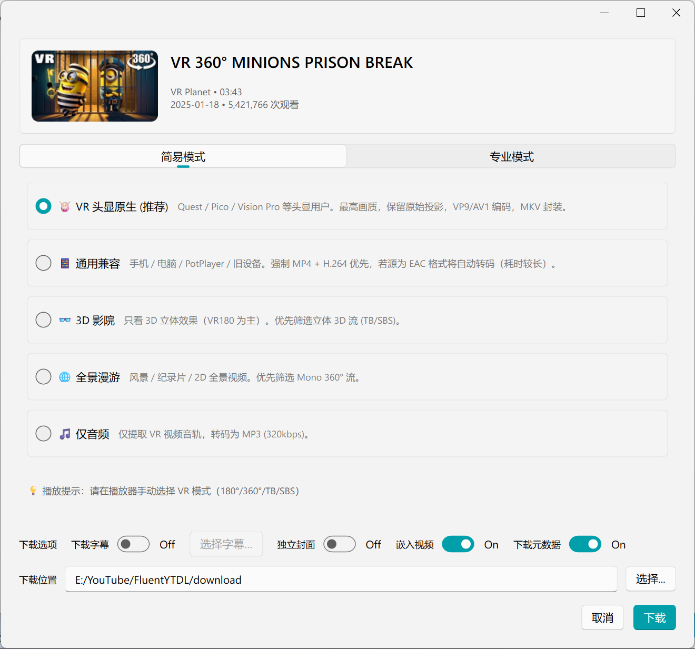

#### 3. VR 解析页 - 专业模式
如果您对 VR 视频的编码格式、比特率或音频流有更严苛的要求，可以自由切换到 **“专业模式”**。
在这里，您不仅能像处理普通视频一样，分别对底层的视频流和音频流进行拆解与组合，还能清晰地看到这些特化 VR 数据流（如分辨率高达 4K/8K 的 3D 画幅）的真实编码与详细参数。这让骨灰级玩家能够精准抓取最高码率的全景画面，并将其与最高质量的独立音轨进行完美硬核的重新拼接封装。

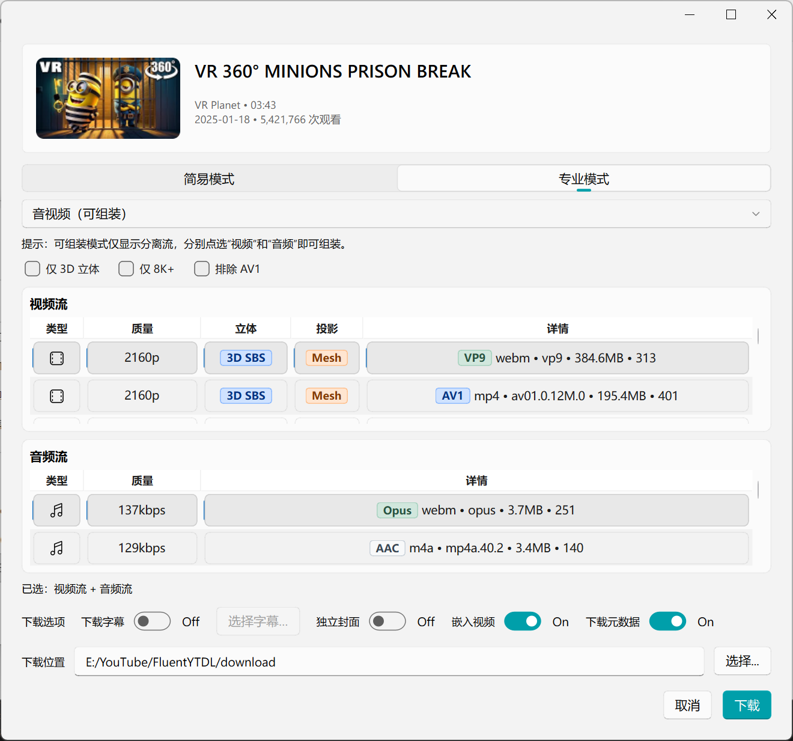

#### 4. VR 视频与播放列表的完美联动
不仅是单支 VR 视频，FluentYTDL 同样支持批量解析包含大量 VR 内容的播放列表（Playlist）。
当您输入一个 VR 视频合集的列表链接时，解析大盘会准确地给列表中的每一个 VR 视频打上醒目的 `[VR]` 专属标识。您依然可以使用顶部的“全局格式”将特定画质一键应用到所有的 VR 视频上，极大地提升了构建本地全景媒体库的效率！

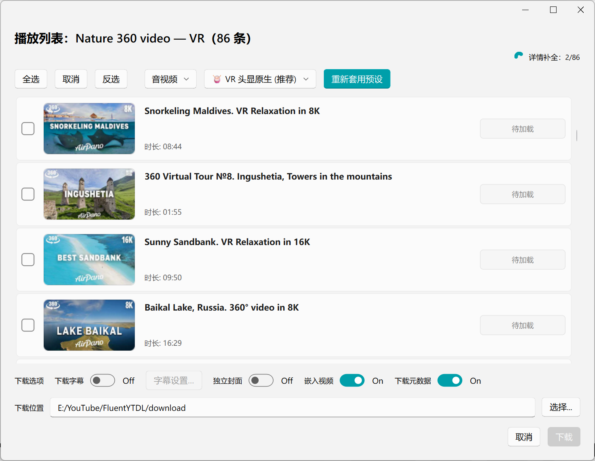

### 2.5 独立字幕提取解析

如果您只是为了获取语言学习资料，或者为二次剪辑寻找外挂字幕素材，而不想去下载庞大的视频流，FluentYTDL 提供了专注且纯粹的“独立字幕解析”功能。

#### 1. 字幕解析模式
在主界面左侧边栏切换到“字幕解析”模式后，粘贴视频链接并点击解析。

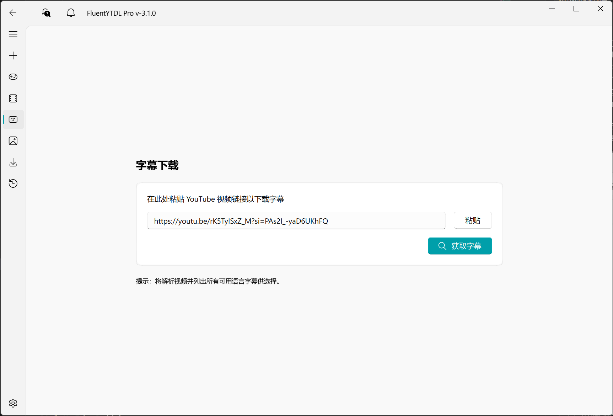

#### 2. 多语言纯净下载
在弹出的字幕解析专属大盘中，去掉了繁杂的画质选项，您只会清晰地看到该视频携带的所有字幕轨道（包含创作者上传的官方字幕与 YouTube 机器翻译字幕）。勾选所需语言，系统会瞬间将其单独下载并保存为极小体积的 `.vtt` 或 `.srt` 文件。
**✅ 播放列表支持**：与视频下载一致，该模式同样完美支持播放列表/频道链接。您可以利用列表大盘的“全局统一设置”，一键批量扒下上百个视频的指定语言字幕！

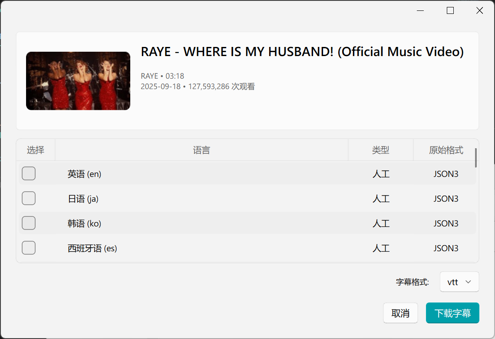

### 2.6 独立封面提取解析

对于想要收集高清海报、获取 YouTube 缩略图用于素材库或整理资料的用户，FluentYTDL 的“独立封面解析”模式是您的最佳助手。

#### 1. 封面解析模式
在主界面左侧边栏切换到“封面解析”模式，粘贴视频链接。

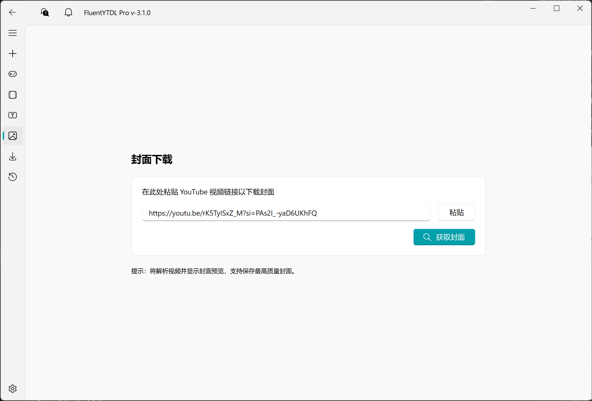

#### 2. 高清封面下载
解析完毕后，界面将直观地展示该视频系统里可用的最高清缩略图 (Thumbnail/Cover)。点击“下载”，即可不花任何多余流量，瞬间将其保存为 `jpg` 或 `webp` 等高质量图片格式。
**✅ 播放列表支持**：没错，这同样支持批量操作。只需放入播放列表链接，一键点击，就能把整个频道的视频海报全部“据为己有”！

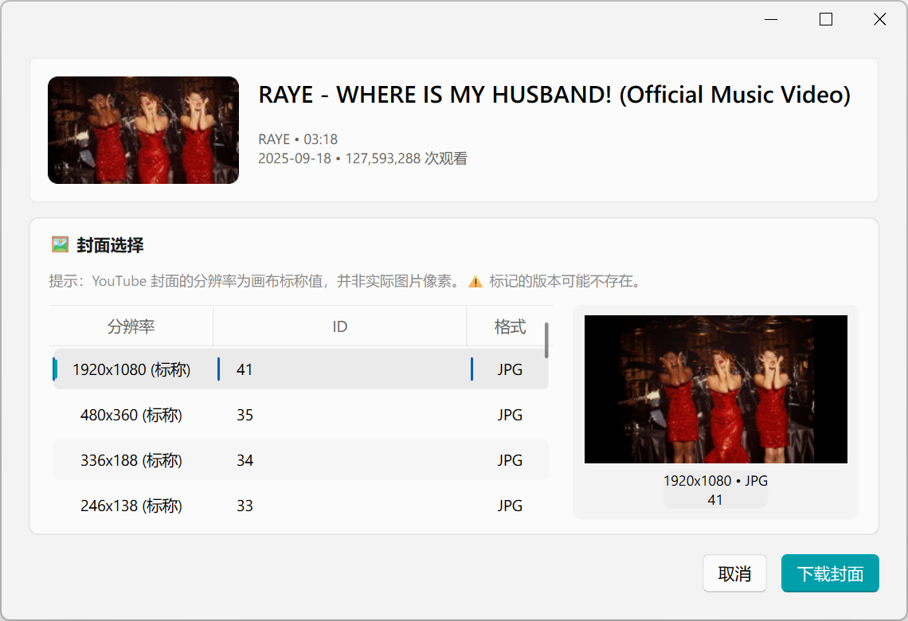

### 2.7 参数与高级配置

点击主界面左下角的齿轮图标进入“设置页”，您可以对 FluentYTDL 的底层行为进行全方位的自定义与深度调优。

#### 2.7.1 账号验证 (Cookies 获取与防风控)
面对 YouTube 日益严苛的“机器人拦截机制”，以及为了顺利解锁“年龄限制”和“会员专属频道”的视频，正确配置身份凭证至关重要。我们在设置页提供了三种获取方案，并**强烈推荐使用“登录获取”作为主力方案**：

##### 1. 登录获取 (最优解 & WebView2 沙箱)
这是底层最安全、最无痛的方式。
- **安全登录与永生守护**：点击登录按钮，软件会弹出一个完全隔离的 WebView2 沙箱供您授权 Google 账号。更重要的是，**独家研发的 `CookieSentinel` 永生守护进程仅存在于该模式下**。它会在后台模拟真实人类行为自动刷新凭证生命周期，彻底终结“用几天 Cookie 就失效报错 403”的痛点。
- **多账号快速切换**：点击“新增账号”为其命名，下拉切换至该新建账号，再点击“登录 YouTube 获取 Cookie”即可完成录入。后续只需在下拉列表中随意切换账号，底层管线便会自动为您挂载对应的 Cookie。

##### 2. 浏览器提取
- **工作机制**：引擎会尝试从本机的 Edge、Chrome 等浏览器中直接抓取现成的 YouTube 会话 Cookie。
- **⚠ 局限性 (非最优解)**：由于自 Chrome v130+ 版本起引入了底层应用绑定加密 (App-bound Encryption)，此操作**必须要求 FluentYTDL 以管理员权限运行**。受限于复杂的本地安全策略，此方案容易失败，仅作为备用手段。

##### 3. 手动导入
针对高级玩家或抓包用户，您可以选择手动导入模式。将外部抓取的 Netscape 格式文件或纯文本 Cookie 导入底层系统即可强行接管身份。

##### 4. 独家核心：合规清洗与隐私过滤机制 (Cookie Sanitization)
无论是通过上述哪一种途径获取的 Cookie，在被底层引擎接管前，**都必须强制经过 FluentYTDL 的 `CookieCleaner` 合规清洗管线**。这不仅是为了保护您的隐私，更是为了让底层 `yt-dlp` 的请求达到最高纯净度，大幅降低被风控的概率：
- **域名级白名单隔离**：引擎会直接剔除所有非 `youtube.com` / `google.com` 的跨站杂乱 Cookie，防止任何无关站点的追踪数据被错误上传。
- **最小化运行原则 (精准 Name 拦截)**：系统内置了极其严苛的 YouTube 核心 Token 白名单。它会强行剥离所有用于广告画像、行为追踪的冗余数据，**仅放行**维持账户运转所必需的极少数关键令牌（如 `SID`、`__Secure-1PSID`、`LOGIN_INFO` 等）。
- **Netscape 标准化重构**：引擎会自动剔除原始数据中附带的多余属性，仅严格保留标准的 Netscape 六大核心字段，并实时销毁已过期的失效碎片。

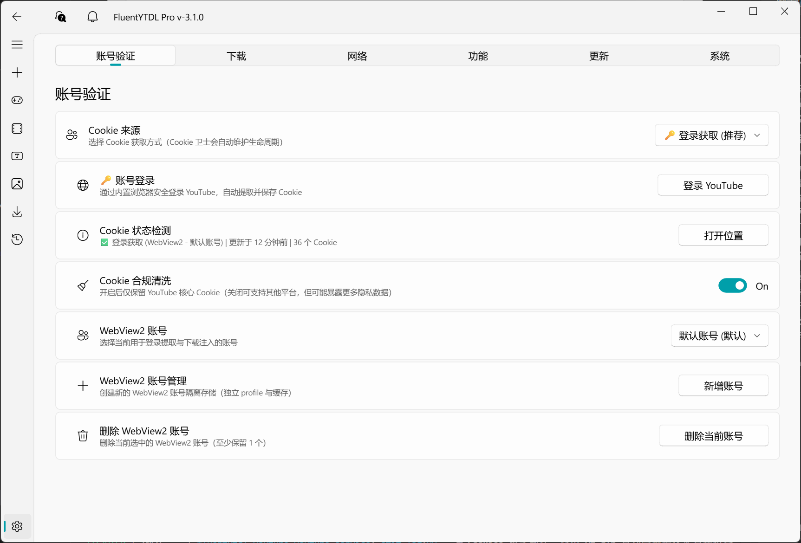

#### 2.7.2 下载引擎调优与核心偏好
在设置页中，围绕着底层下载管线，我们提供了一整套从“并发风控”、“多语言调度”到“字幕抓取”和“画质检验”的硬核配置矩阵。

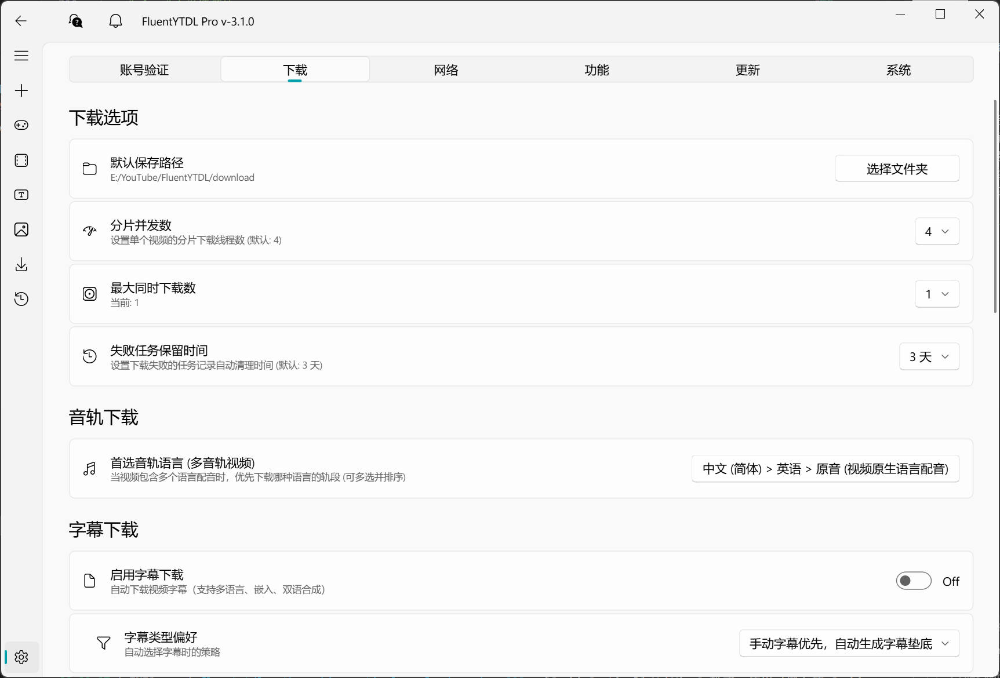
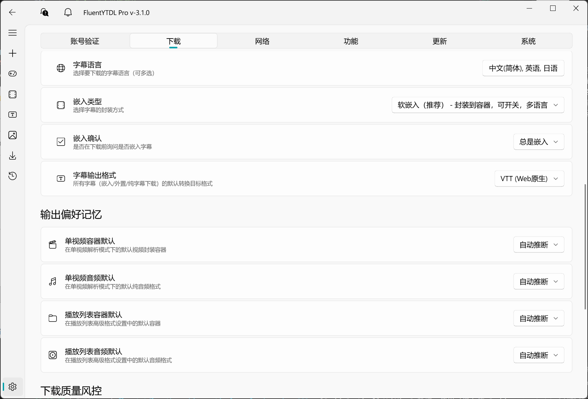
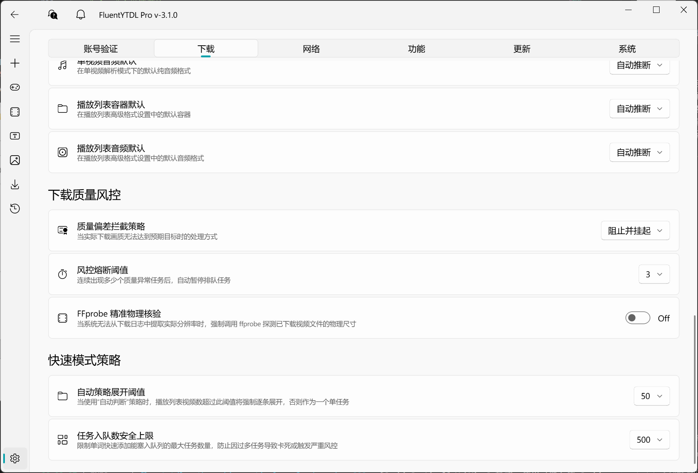

##### 1. 下载选项：并发机制与风控警告
底层管线向服务器发起的总连接数，等于 **“分片并发数” × “最大同时下载数”**。这会产生一个极其危险的叠加乘数效应：
- **触发风控红线**：如果您盲目将参数拉满（例如同时下载 5 个视频，每个视频切成 8 块拉取），这会在瞬间向 YouTube 发起 40 个高强度并发请求。这极大概率会直接“炸出” YouTube 的反爬虫风控系统，导致 IP 临时封禁或极其珍贵的 Cookie 直接报废（403 报错）。
- **配置建议**：细水长流才是批量下载的生存之道。建议“分片并发数”保持在 3~5 之间，“最大同时下载数”保持在 2~3 左右，足以跑满大多数家庭宽带，并安全避开风控雷达。同时您也可设定“失败任务保留时间”以防止日志堆积。

##### 2. 音轨下载：多语言优先顺位引擎
针对 YouTube 上越来越多挂载多国语言配音的顶级大作，我们开发了极其直观的**拖拽式顺位排序系统**。
您可以在备选池中挑出所需的语言（如：简体中文 > 英语 > 原音），并将它们按心意上下拖拽排序。在未来的无脑下载中，底层会自动探查该视频附带的所有音轨，严格按照您的顺位最高级进行精准剥离与底层重组。

##### 3. 字幕下载：字幕配置与媒体封装策略
对于外语学习者或视频搬运工，这套模块赋予了您极高的颗粒度控制权：
- **字幕类型偏好 (容错降级机制)**：您可以精确指定抓取的字幕纯净度：是“仅限创作者手动上传的纯净字幕”，还是“手动优先，机器自动识别的字幕垫底”，甚至是一网打尽包括各种自动翻译的衍生字幕。彻底解决普通下载器把机翻当宝的乱象。
- **多语言批量抓取**：支持多选语种（如：简中、繁中、英语同开），底层会自动把这几种语言打包拉下。
- **字幕嵌入与分离机制 (Embed Type)**：
  - **软嵌入 (Soft Subtitles)**：推荐！调用 FFmpeg 把下载的字幕无损“压入” MP4/MKV 容器，在播放器中可自由开关切换，文件依然干净。
  - **外置文件 (External)**：强制分离生成独立的 `.srt`，适合放进 Premiere 等剪辑软件二次创作。
- **终极格式转换器**：无论官方返回的是奇葩的 VTT 还是 SBV，落地前均会被底层强行转码为您指定的输出格式（如通用性极强的 `SRT` 或支持样式的 `ASS`）。

##### 4. 输出偏好记忆
您可以分别针对“单视频解析”和“播放列表解析”，预先设定好各自的**默认视频封装容器**（如 MP4、MKV 等）以及**默认音频格式**（如 MP3、FLAC 等）。在主界面操作时无需反复指定，系统会直接调取预设偏好，极大提升批处理效率。

##### 5. 终极底线：下载质量风控 (Quality Guard)
在批量下载或高频抓取时，有时会遭遇 YouTube 的暗中反爬限流策略（例如不报错，但强制把你请求的高清流降维打击成 360p 糊片）。为了彻底捍卫您的本地媒体库纯洁性，我们开发了一套深植于底层的 **Quality Guard (四维质量守卫体系)**，并开放了以下核心控制权：
- **下载前预检 (Preflight Check)**：在任务开跑的瞬间，引擎会根据您的 `QualityIntent` (质量目标，如 1080p) 去解剖返回的 format 列表。如果发现“目标 1080p → 最高可用 720p”，会在消耗流量前提前触发警告。
- **强制启用 FFprobe 探测 (Post-Verify)**：开启此项后，管线在文件封装落地前，不信任任何 API 返回的伪造元数据，而是强行拉起底层的 `ffprobe.exe`，暴力解剖视频文件的底层流 (Stream)，去抓取最真实的物理像素 (Width/Height) 作为最终裁决依据。
- **质量偏差拦截策略 (Fallback Policy)**：当实际画质不达标时您想如何处理？
  - `仅警告 (Warn)`：继续放行，但在 UI 上打上显眼的降级标签。
  - `阻止并挂起 (Block)`：直接拦截该文件的落盘动作，将其打入冷宫。
  - `忽略差异 (Ignore)`：佛系收割机专用，有啥下啥。
- **全局风控熔断阈值 (Suspend Threshold)**：如果连续出现 N 个（如设为 3 个）画质异常任务，底层 `QualityGuardManager` 会立刻判定当前 IP 或 Cookie 已经触发了 YouTube 的隐性限流风控。此时引擎会**强制挂起 (Suspend) 整个剩余排队队列**，并推送高危通知，以免您珍贵的账号在黑洞里越陷越深。

#### 2.7.3 功能与高级扩展 (Features & Post-processing)
在设置页左侧切换到 **“功能”** 面板，这里藏着一系列能极大提升使用体验和产出质量的自动化与后处理引擎。

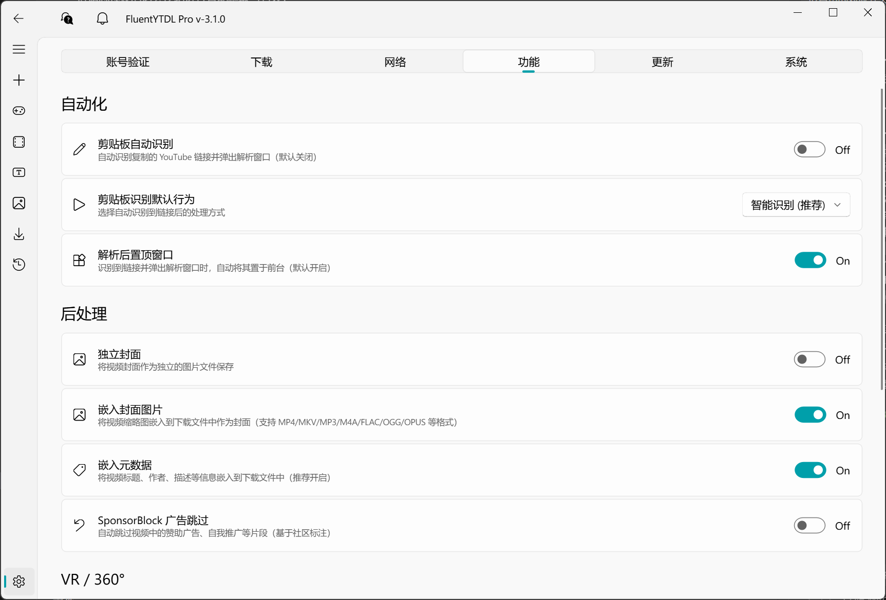

##### 1. 自动化感知引擎 (Automation)
- **剪贴板自动识别**：开启后，引擎会静默监控剪贴板。当您在浏览器中复制任意 YouTube 链接（甚至包含复杂的时间戳和列表参数）时，FluentYTDL 会瞬间被唤醒并在前台弹出解析窗口。
- **剪贴板识别默认行为**：您可以为剪贴板监听绑定特定的模式（如：只识别普通下载、只触发 VR 下载，或只拉取封面），让系统成为您最高效的抓取外挂。

##### 2. 海报墙刮削与元数据注入 (Postprocess)
这个板块是为 Emby、Plex 和 Kodi 媒体库玩家量身打造的重头戏：
- **独立封面 / 嵌入封面图片**：您可以选择让最高清的海报作为独立 `jpg` 保存在视频旁边，或是让底层引擎在封装时将其直接压入 `MP4/MKV` 的容器底层。
- **嵌入元数据 (Embed Metadata)**：强烈建议开启！底层会将原视频的“标题”、“频道作者”、“原发布时间”甚至“视频简介详情”完整地注入最终的文件中。这些视频入库的瞬间，绝美的海报墙和详情页就能完美呈现，无需依赖第三方刮削器！

##### 3. SponsorBlock 广告智能跳过
YouTube 视频里经常有作者长达几分钟的“恰饭”口播或赞助推广？
只要开启了 **SponsorBlock 广告跳过**，底层引擎会在下载前访问社区的众包标注数据库。您可以点击“跳过类别设置”，自由勾选要剔除的片段（如赞助商、开头动画、自我推广、无声前奏等）。最终下载到本地的文件将是一部**被精剪过、毫无水分**的纯净成片！

##### 4. VR / 360° 硬件加速控制 (待完善功能)
*注：该功能的底层硬件加速转码管线暂未完全实装，当前处于开发阶段，敬请期待后续版本更新。*

#### 2.7.4 第三方组件与环境升级 (Components & Updates)
对于一款与视频网站反爬机制长期对抗的工具，保持底层引擎的“新鲜度”是第一生产力。在 **“更新”** 面板中，我们为您打造了一个高度集成的环境包管理器：

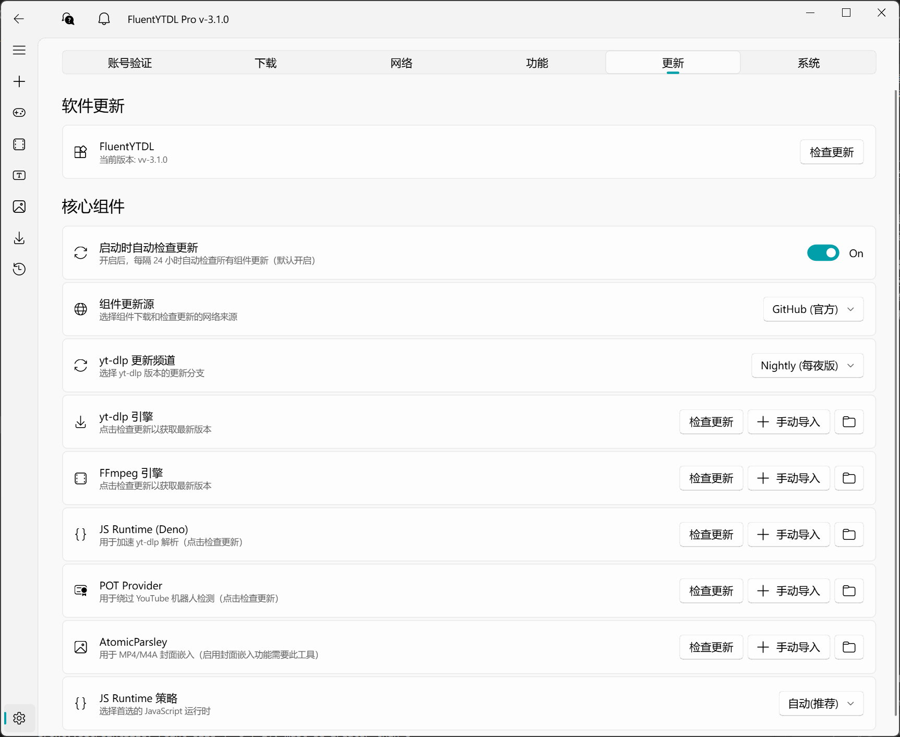

##### 1. 自动检查与更新通道
- **自动检查守护进程**：开启后，引擎将在后台以 24 小时为周期，静默轮询所有底层组件的版本。一旦发现新版，会在右上角温柔提示您，绝不强制打断当前任务。
- **更新源加速 (GHProxy)**：如果您身处无法顺畅访问 GitHub 的网络环境，强烈建议将**组件更新源**切换为 `GHProxy (加速镜像)`。
- **yt-dlp 更新频道 (对抗封锁的关键)**：针对 YouTube 频繁修改 API 导致下载大面积报错的紧急情况，您可以果断切换以下更新分支以寻求自救：
  - `Stable (稳定版)`：经过完整测试的正式版本，日常使用的默认首选，稳定性最高。
  - `Nightly (每夜版)`：包含最新特性与修复的每日构建版。如果 YouTube 突然大改风控机制，几天内通常就会在这个版本里放出解药。
  - `Master (主线源码)`：最激进、最新的开发者代码。当遇到严重封杀，甚至 Nightly 都来不及发版时，直接拉取主线源码是硬核极客续命的最后手段。

> [!IMPORTANT]
> **为何一定要保持 yt-dlp 处于最新状态？**
> 很多用户经常抱怨“为什么我只能下到 360p 的糊片”或“为什么下载一直爆出 HTTP 403 / 机器人质询的错误”。这通常**并非您的网络不佳或软件损坏**，而是 **YouTube 官方又悄悄更新了反爬虫算法和签名混淆参数**！
> 一旦官方改版，旧版的解析引擎会因为算法过期而被精准识别并限流。遇到此类异常时，**您排查问题的第一反应，应该是立马进入此面板一键更新 yt-dlp 及其依赖组件**，用最新版的魔法去打败官方新出的魔法！

##### 2. 五大底层核心引擎
FluentYTDL 的强大，建立在以下五个坚如磐石的命令行巨头之上，您可以在此面板一键将它们统统升级至最新版：
- **`yt-dlp`**：一切流媒体解析与拉取的绝对核心，我们的“老大哥”。
- **`ffmpeg`**：负责将视频切片、音轨与字幕进行无损组装与重构的魔术师。
- **`deno`** (JS Runtime)：被底层引擎深度调用，以极高的性能执行复杂的 JavaScript 混淆算法逆向破解。
- **`pot-provider`** (Proof of Token)：为了应对 YouTube 近期丧心病狂的“机器人质询（Bot Challenge）”而生的终极防御组件。
- **`atomicparsley`**：一个专门用来撬开 `MP4/M4A` 容器底层，并将海报与元数据死死注入进去的微型手术刀。

#### 2.7.5 系统行为与极客控制 (System & Advanced)
在设置页的最后一个 **“系统”** 面板中，包含了外观主题调节、常规软件行为，以及专为硬核极客准备的最深层风控对抗武器。

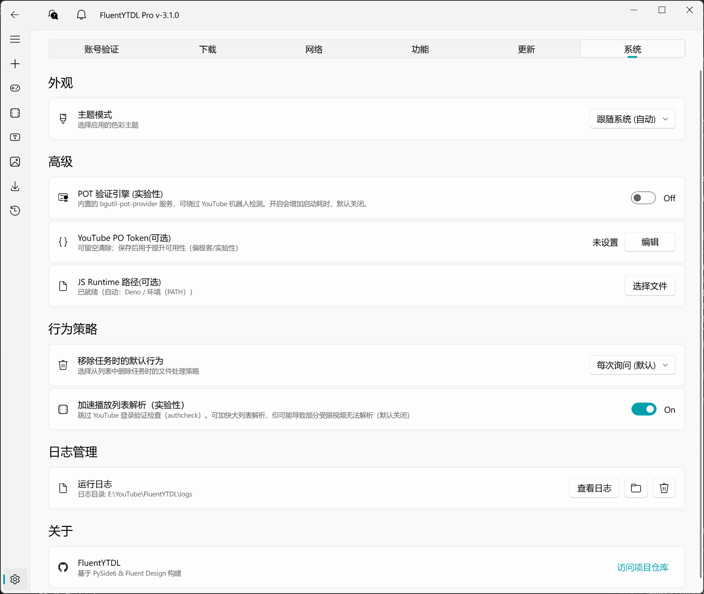

##### 1. 终极防封杀：POT 验证引擎与 JS Runtime
这是本软件区别于普通下载器的核心“黑科技”，专门用来应付 YouTube 最新上线的 Bot 检测：
- **POT 验证引擎 (bgutil-pot-provider)**：开启后，引擎会在后台默默启动一个真实的微型服务器。当 YouTube 怀疑你是机器人并下发极其刁钻的验证码挑战时，它能在本地秒级生成名为 `PO Token` (Proof of Origin) 的合法通行证，从而直接绕过封杀。
- **手动 PO Token 注入**：如果您有自己的获取渠道（如从浏览器的 Network 面板中提取到了长效 `mweb` 或 `visitor` Token），可以直接粘贴在这里。底层会在每次发包时将其伪装成真人浏览器的签名带上。
- **JS Runtime 路径**：YouTube 经常会动态下发被严重混淆的 JavaScript 算法来加密视频流地址。如果您在此指定了 `Node.js` 或 `Deno` 的物理路径，引擎会直接在沙箱里跑一遍官方的 JS 代码，“以彼之道还施彼身”，瞬间扒出真实的下载直链。

##### 2. 行为策略控制
- **移除任务时的默认行为**：防止手滑！当您在下载列表中点击删除时，是“只删除界面的记录条目”，还是“连带硬盘上的实体文件一并销毁”？您可以在此提前定好规矩。
- **加速播放列表解析 (实验性)**：当您丢进一个包含几百个视频的超级合集时，常规解析极其缓慢。开启此项后，引擎会**强行跳过 YouTube 的登录权限挨个校验 (`authcheck`)**，实现秒级拉取列表元数据。但代价是，如果列表里混有“会员专属”或“年龄限制”的视频，它们可能在后续下载时报错。

##### 3. 日志输出与故障打包 (Logs & Debugging)
不论底层的 `yt-dlp` 发生崩溃，还是网络连接意外中断，FluentYTDL 都会在底层严密监控并记录全套诊断信息。在系统页面的底部，您可以找到专属的 **“日志管理”** 模块。

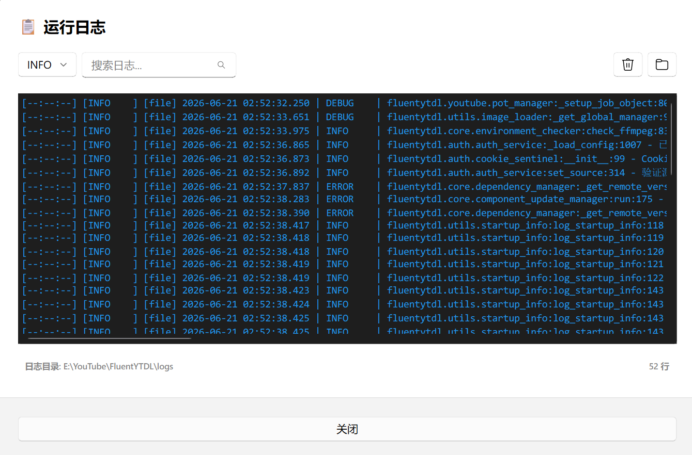

> [!TIP]
> **遇到 BUG 怎么办？如何正确提取并提交日志？**
> 如果您在使用中遇到了无法解析、闪退、下载卡死等异常，请严格按照以下步骤提取日志并提交给开发者：
> 1. **定位日志位置**：滚动到设置页面的最底部，您会看到“日志管理”卡片，上面清晰地标注了当前的物理日志存放目录（如 `app_data/logs`）。
> 2. **提取报错信息**：点击 **“查看日志”** 可以直接在应用内唤出日志阅读器；如果您需要将整个文件打包发给开发者，请点击旁边的 **“文件夹图标”**，系统会直接为您在资源管理器中定位到该目录。
> 3. **精准提报 Issue**：在 GitHub 提交 Issue 时，请务必将发生错误当天的 `.log` 实体文件作为附件拖入反馈框，或是将其中的 `[ERROR]` 级别信息复制并用 markdown 代码块包裹提交。这将帮助我们以最快速度复现并修复您遇到的玄学 BUG。

### 2.8 快速下载 (Quick Download Strategy)
对于喜欢批量“进货”和使用主界面极简解析模式的用户，设置页中的 **“快速模式策略”** 是专门用来平衡解析速度与风控安全的幕后功臣。

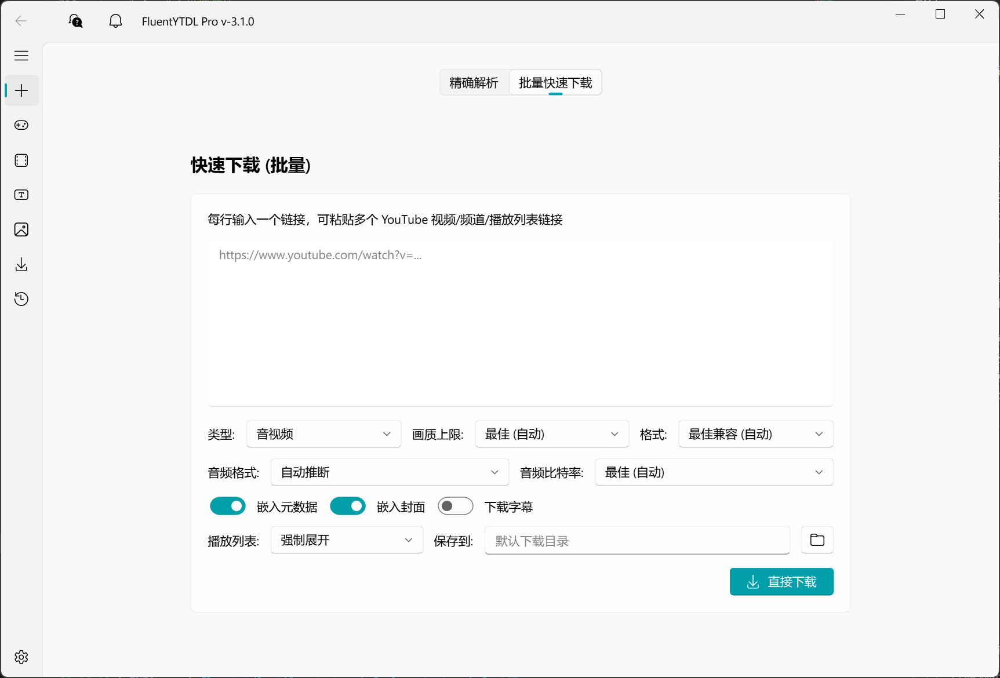

##### 1. 自动策略展开阈值
当您将一个包含大量视频的 YouTube 播放列表丢进“自动判断”模式时：
- **阈值之下**：系统会将其视为“单体任务”直接抛给底层 yt-dlp 进行大一统处理，省时省力。
- **阈值之上**：为了防止单个巨型任务由于某一个视频卡住而彻底失败，系统会自动在前端对其进行暴力拆解（强制逐条展开）。拆解后，每个视频都会变成独立的并行下载任务，互不干扰，即使个别失败也能继续下载剩余内容。

##### 2. 任务入队数安全上限
**这也是一道极其关键的风控防御红线！**
当您试图一次性拉取成百上千个视频时，如果同时将它们全部塞入前端排队栈，不仅可能瞬间卡死 UI 界面，还会由于极高频的并发探测瞬间被 YouTube 的风控机器当场“击毙”。
因此，在这里设置一个合理的入队上限（例如 500 个），系统会拒绝超额的离谱解析请求，强迫您细水长流，从而彻底保护您的真实网络环境和 Cookie。

---

## 3. 常见问题解答 (FAQ & Troubleshooting)

### 3.1 核心体验与下载异常

#### 3.1.1 为什么下载的视频清晰度不匹配（如请求 1080p 却只下到 360p）？
如果您发现下载到本地的视频是个画质模糊的“残次品”，请不要慌张。这通常是由以下三种原因导致的：

1. **原视频本身没有提供该画质**
   YouTube 会对不同热度、不同时期的视频进行差异化的分布式转码。有些老视频或冷门视频，其服务器上最高可能只有 720p 甚至 480p 的源文件。
   
   **👉 解决对策**：前往设置页开启**“下载质量风控 (Quality Guard)”**。开启后，引擎会在消耗流量前为您拦截并进行预检，如果原片画质达不到预期，系统会明确报警，避免下载后才发现是糊片。
   
2. **触发了 YouTube 的隐性风控 (最常见)**
   当您短时间内高频批量下载，或所使用的底层解析算法已经过期时，YouTube 不会直接阻断您的网络，而是会采用非常阴险的“降维打击”——直接把你请求的 1080p/4K 串流强行替换下发为 360p 的兜底流。
   
   **👉 解决对策**：
   - 立即前往“设置 -> 更新”面板，一键将 **`yt-dlp` 更新到最新版本**（若依旧不行，果断将频道切换至 `Nightly` 分支获取最新补丁）。
   - 确保您已开启 **POT 验证引擎** 或登录注入了有效的 **Cookie**，以此向 YouTube 证明您是“真实人类”。
   
3. **网络剧烈波动导致的动态降级**
   当底层引擎拉取视频切片时，如果遇到严重的梯子节点阻塞或网络丢包，有极小概率会为了保证下载任务不断开而被迫抓取低清晰度的备选流。
   
   **👉 解决对策**：检查您的代理节点状态，并尝试在设置中适当调低“单任务分片并发数”，以避免瞬间挤兑宽带。

#### 3.1.2 为什么下载总是报超时 (Timeout) 或 403 拒绝访问？（网络环境的四大基本法）
作为一款需要与海外流媒体服务器进行极高频数据交互的工具，FluentYTDL 对您的**本地路由出口与网络环境**有着极为苛刻的要求。遇到网络层面的报错时，请依次排查以下四个维度：

1. **连通性 (Connectivity) —— “门是否开着”**
   在现代网络环境中，我们**强烈不建议**您在 FluentYTDL 内部手动死磕 HTTP/SOCKS5 代理端口配置。最佳实践是交由您的本地网络接管软件（代理客户端）来统筹全局。
   
   **👉 排查建议**：请在您的代理软件中开启 **TUN (虚拟网卡) 模式** 或是全局系统代理。当底层路由被正确接管时，FluentYTDL 无需任何网络设置即可丝滑出海。
   *（注：如果您使用的是仅依附于浏览器的“插件类网管工具”，它们只能接管浏览器进程内的流量，**绝对无法覆盖到操作系统的底层网络栈**。这也就是导致许多用户“明明网页能看，但软件完全连不上”的根本物理原因，请务必使用系统独立运行的接管客户端。）*

2. **可达性 (Reachability) —— “路是否走得通”**
   很多用户抱怨：“我明明能流畅看网页版 YouTube，为什么软件一解析就报错？”这是因为视频真正的流媒体分发节点 (CDN) 往往走的是不同于网页的特定长链域名（如 `*.googlevideo.com`）。
   
   **👉 排查建议**：请检查您的本地分流规则策略组（Rule）。确保所有与 Google 和 YouTube 底层相关的流媒体域名，都被正确分配到了海外出口，而不是被误判直连导致阻断。

3. **稳定性 (Stability) —— “桥是否结实”**
   大体积视频的多线程并发下载，对瞬间的宽带峰值和长连接要求极高。如果您的网络出口负载过大，一旦瞬间拉起十几根线程并发，极易导致通道拥塞乃至 TCP 链接重置。
   
   **👉 排查建议**：遇到下载进度条反复“横跳”、卡死在 99% 或是频繁报错 `Connection reset by peer` 时，请尝试在设置中将“单任务并发分片数”降低至 2~4，用时间换取稳定性。

4. **纯净度与账号权重 (Purity & Account Weight) —— “你是否被盯上了”**
   YouTube 的反爬虫大脑极其敏锐。导致 HTTP 403 拒绝访问或无限超时的终极元凶，往往归结于以下两点：
   - **IP 连坐**：您使用了请求量极其异常的公用出口（俗称“万人骑节点”），直接被服务器底层拒载。
   - **临时限流 (Rate Limit)**：即使您注入了真实的 Cookie，但如果该账号是缺乏日常使用记录的“白板号”，又或者您在短时间内**疯狂拉取了成百上千个视频**，会瞬间触发账号的高危预警。
   
   **👉 诊断与自救**：请尝试在浏览器中打开目标视频。如果您发现**连网页端都在无限转圈、弹跳出人机身份验证，甚至直接提示视频无法播放**，说明当前的 IP 或账号已被关进“小黑屋”。
   此时请立即停止所有解析任务，更换高质冷门节点，等待 12~24 小时自然解封；或者改用活跃的高权重老账号（如 Premium 账号）来拉升底层的信任值。

#### 3.1.3 为什么你们的下载速度显示忽快忽慢，而别的软件看起来很稳定？
很多用户会发现，FluentYTDL 界面的下载速度常常在 `500KB/s` 到 `25MB/s` 之间疯狂横跳，而有些老牌下载器却能一直稳如泰山地显示 `10MB/s`。这并非软件的下载管线出了故障，而是由**底层数据采集哲学**决定的：

1. **真实物理切片的瞬时爆发 (`-N` 并发机制)**
   在底层，FluentYTDL 调用 `yt-dlp` 时默认开启了**高并发分片下载引擎 (`concurrent_fragments`)**。当多个线程同时向 YouTube 服务器“抢夺”几十 KB 的视频切片时，网卡会产生极高频的脉冲式流量爆发。
   
2. **硬核的原始速率直出无滤镜**
   如果您翻看本项目的底层 `output_parser.py` 代码，会发现我们采用正则表达式在极短的毫秒级周期内，直接生擒了底层引擎返回的**绝对瞬时速度**。而市面上许多看起来“稳定”的商业软件，其实在前端套了一层“平滑算法（如 5 秒滑动窗口平均值）”来粉饰太平。

**👉 结论**：忽快忽慢的跳动，才是现代并发分片网络请求最真实、最硬核的物理心跳。请不用担心，无论它怎么跳，最终的总耗时才是检验引擎算力的唯一标准。

#### 3.1.4 为什么有些视频提示“需要登录”或直接报错？(年龄限制、会员与 DRM)
当您遇到某些特定的视频无法被解析或下载时，通常是因为碰到了以下几道“权限墙”或“版权墙”：

1. **年龄限制视频 (Age-Restricted Content)**
   - **现象**：解析时遇到 `Sign in to confirm your age` 拦截报错。
   - **原因与对策**：该视频被 YouTube 官方标记为成人或血腥等限制级内容，强制要求观众登录以验证年龄。游客级的匿名请求会被无情拒载。
   - **破局方式**：前往设置页的“账号与权限”模块，导入一个**已满 18 岁且状态正常**的普通 YouTube 账号 Cookie 即可解封。

2. **频道会员专享视频 (Members-only Content)**
   - **现象**：解析时控制台抛出含有等级要求的长段报错，例如：`ERROR: [youtube] ... This video is available to this channel's members on level: ... Join this channel to get access to members-only content and other exclusive perks.`
   - **原因与对策**：这些视频是 YouTube 博主针对付费订阅的频道会员开启的私域内容。
   - **破局方式**：在设置页导入您**已经购买了该频道会员**的账号 Cookie。底层引擎在挂载您的会员 Cookie 后，便会以 VIP 身份合法突破权限墙。

3. **DRM 加密保护视频 (收费电影/剧集)**
   - **现象**：遇到 YouTube Movies 频道的收费电影时，解析直接报错拒绝访问；或者勉强下载到本地后，用任何播放器打开都是**一片黑屏或花屏**。
   - **原理与限制**：这类视频受到了流媒体最高级别的 **Widevine DRM (数字版权管理) 强加密保护**。
   - **最终定论**：目前包括 `yt-dlp` 在内的所有常规开源解析生态，**在法律与技术双重层面上，均明确拒绝且无法支持对 DRM 视频的解密提取**。如果您遇到这类受 DRM 保护的视频，请放弃下载念头，这是无法突破的物理底线。

### 3.2 技术栈定位与竞品管线差异 (Architectural Differences)
经常有开发者会在 GitHub 提问：既然市面上已有海量的 YouTube 下载工具，本项目的技术护城河究竟在哪里？以下从软件架构与底层流媒体通信协议的角度，客观剖析我们与主流方案的技术差异：

1. **vs. Web-based Parsers (云端解析站)**
   - **架构瓶颈**：云端解析强依赖服务器集群的中心化出口 IP，极易触发 YouTube 针对 IP 段的 `429 Too Many Requests` 及高危 Bot 拦截。此外，受限于服务器下行宽带和昂贵的存储转发成本，云端管线通常会主动丢弃流媒体中的高码率层，仅通过 HTTP 重定向下发最高 720p、已经封装好的低码率 `AVC(H.264)` 流。
   - **本地原生管线**：FluentYTDL 采用纯本地的胖客户端 (Fat Client) 架构，直接利用宿主机的代理网络与 YouTube Edge CDN 建立长连接。在算力和带宽完全不设限的前提下，直接解包拉取物理底层真正的 `VP9 / AV1` 编码的 4K/8K 原始切片。

2. **vs. Open-source CLI Wrappers (常规开源前端)**
   - **架构瓶颈 (缺乏热更新管线)**：GitHub 上的常规开源下载器大多采用极度松耦合的“抛弃式”进程调用。它们严重依赖系统本地预装的环境，或将底层引擎硬编码封死在安装包内。由于缺乏**动态环境自举能力**，一旦 YouTube 修改防爬算法（这是常态），这些套壳 GUI 将集体陷入“脑死亡”，用户只能被动且痛苦地等待原作者重新发版。
   - **核心优势：自建微型包管理器与热重载**：这正是本软件最坚固的技术护城河。FluentYTDL 本质上是一个具备**模块化热更新能力**的运行容器。我们在内部构建了独立的 Component Updater，能在后台非阻塞地直连网络，对解析器 (`yt-dlp`)、混淆突破沙箱 (`Deno`) 以及防风控质询引擎 (`POT Provider`) 进行独立版本轮询与热重载。当 YouTube 发难时，我们的用户无需重装软件，只需在界面一键拉取底层引擎的最新 Nightly 补丁即可瞬间“解毒”，实现了对平台规则更迭的降维免疫。

3. **vs. 传统商业嗅探器 (Traditional Commercial Downloaders)**
   - **流量嗅探架构的局限性**：以 IDM 为代表的商业下载器核心机制为基于浏览器扩展的被动网络层嗅探 (Network Sniffing) 与 HTTP Range 分块下载。这种机制在面对早期单文件流媒体时极为高效，但在 YouTube 采用 `DASH (Dynamic Adaptive Streaming over HTTP)` 协议（将不同分辨率的视频轨道与多语种音频轨道进行物理分离）后，流量嗅探往往只能捕获到单一的流地址。这导致其通常只能抓取到内嵌低码率音频的 720p 视频，或是缺乏音轨的 4K 纯画面文件。此外，被动嗅探无法对抗包含动态时间戳与 JS 混淆的加密签名流。
   - **API 逆向与管道合成架构 (基于开源生态)**：本项目的解析链路不依赖流量拦截，而是依托于 `yt-dlp` 与 `FFmpeg` 核心开源组件的底层能力。通过向 YouTube 发送主动的 API 请求（并注入 User-Agent、PoT 令牌等参数），获取包含完整高码率音视频轨道的 `manifest` 播放列表。随后并行获取独立的最高画质视频流与音频流，并在下载完成后，通过本地挂载的 `FFmpeg` 管道进行多路复用合成 (Multiplexing)。FluentYTDL 在此架构中的工程职责，是提供一套自动化的环境容器，将这套复杂的开源跨进程调用链路与风控环境更新机制进行了完整的接管。

---
